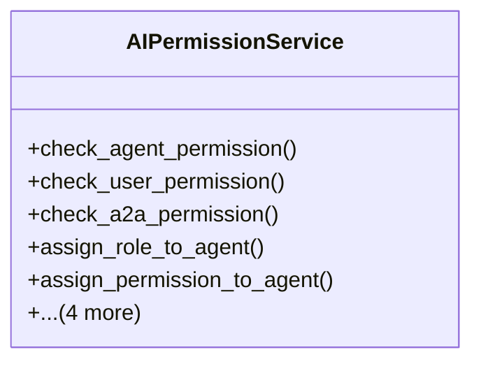

# core_modules.ai_permissions.services

## Imports
- core_modules.permissions.unified_permissions_model
- django.conf
- django.core.exceptions
- django.db.models
- django.utils
- models
- unified_permissions.services

## Classes
- AIPermissionService
  - method: `check_agent_permission`
  - method: `check_user_permission`
  - method: `check_a2a_permission`
  - method: `assign_role_to_agent`
  - method: `assign_permission_to_agent`
  - method: `set_module_permissions`
  - method: `set_a2a_permission`
  - method: `add_permission_dependency`
  - method: `log_permission_use`

## Functions
- check_agent_permission
- check_user_permission
- check_a2a_permission
- assign_role_to_agent
- assign_permission_to_agent
- set_module_permissions
- set_a2a_permission
- add_permission_dependency
- log_permission_use

## Class Diagram

