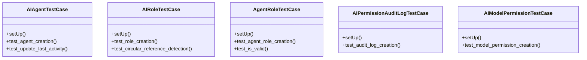

# core_modules.ai_permissions.tests

## Imports
- django.core.exceptions
- django.test
- django.utils
- models

## Classes
- AIAgentTestCase
  - method: `setUp`
  - method: `test_agent_creation`
  - method: `test_update_last_activity`
- AIRoleTestCase
  - method: `setUp`
  - method: `test_role_creation`
  - method: `test_circular_reference_detection`
- AgentRoleTestCase
  - method: `setUp`
  - method: `test_agent_role_creation`
  - method: `test_is_valid`
- AIPermissionAuditLogTestCase
  - method: `setUp`
  - method: `test_audit_log_creation`
- AIModelPermissionTestCase
  - method: `setUp`
  - method: `test_model_permission_creation`

## Functions
- setUp
- test_agent_creation
- test_update_last_activity
- setUp
- test_role_creation
- test_circular_reference_detection
- setUp
- test_agent_role_creation
- test_is_valid
- setUp
- test_audit_log_creation
- setUp
- test_model_permission_creation

## Class Diagram

