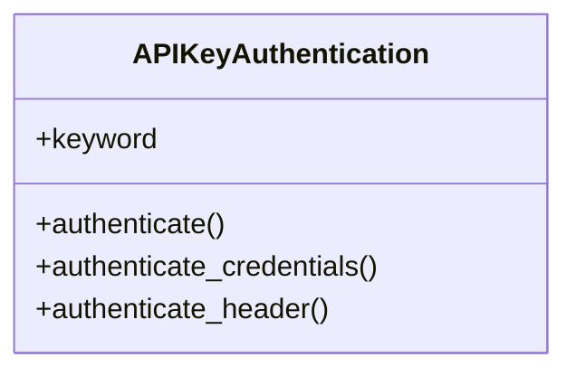

# core_modules.api_keys.authentication

## Imports
- django.utils
- django.utils.translation
- hashlib
- models
- rest_framework
- rest_framework.authentication

## Classes
- APIKeyAuthentication
  - attr: `keyword`
  - method: `authenticate`
  - method: `authenticate_credentials`
  - method: `authenticate_header`

## Functions
- authenticate
- authenticate_credentials
- authenticate_header

## Class Diagram

