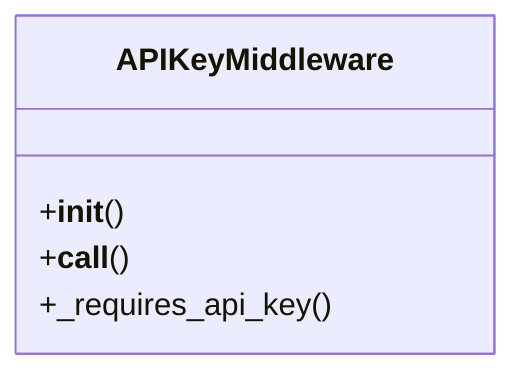

# core_modules.api_keys.middleware

## Imports
- django.http
- django.utils.translation
- services
- time

## Classes
- APIKeyMiddleware
  - method: `__init__`
  - method: `__call__`
  - method: `_requires_api_key`

## Functions
- __init__
- __call__
- _requires_api_key

## Class Diagram

