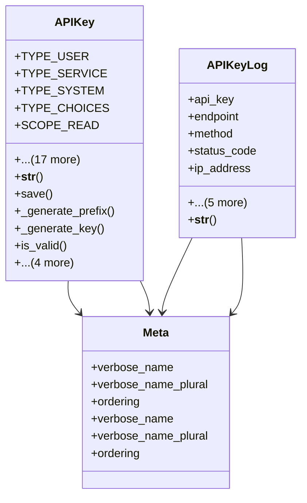

# core_modules.api_keys.models

## Imports
- companies.models
- core.models
- django.conf
- django.core.exceptions
- django.db
- django.utils
- django.utils.translation
- secrets
- uuid

## Classes
- APIKey
  - attr: `TYPE_USER`
  - attr: `TYPE_SERVICE`
  - attr: `TYPE_SYSTEM`
  - attr: `TYPE_CHOICES`
  - attr: `SCOPE_READ`
  - attr: `SCOPE_WRITE`
  - attr: `SCOPE_ADMIN`
  - attr: `SCOPE_CHOICES`
  - attr: `name`
  - attr: `key`
  - attr: `prefix`
  - attr: `type`
  - attr: `scope`
  - attr: `user`
  - attr: `expires_at`
  - attr: `last_used_at`
  - attr: `revoked`
  - attr: `revoked_at`
  - attr: `revoked_reason`
  - attr: `allowed_ips`
  - attr: `allowed_referers`
  - attr: `rate_limit`
  - method: `__str__`
  - method: `save`
  - method: `_generate_prefix`
  - method: `_generate_key`
  - method: `is_valid`
  - method: `revoke`
  - method: `update_last_used`
  - method: `extend_expiry`
  - method: `clean`
- APIKeyLog
  - attr: `api_key`
  - attr: `endpoint`
  - attr: `method`
  - attr: `status_code`
  - attr: `ip_address`
  - attr: `user_agent`
  - attr: `referer`
  - attr: `request_data`
  - attr: `response_data`
  - attr: `execution_time`
  - method: `__str__`
- Meta
  - attr: `verbose_name`
  - attr: `verbose_name_plural`
  - attr: `ordering`
- Meta
  - attr: `verbose_name`
  - attr: `verbose_name_plural`
  - attr: `ordering`

## Functions
- __str__
- save
- _generate_prefix
- _generate_key
- is_valid
- revoke
- update_last_used
- extend_expiry
- clean
- __str__

## Class Diagram

