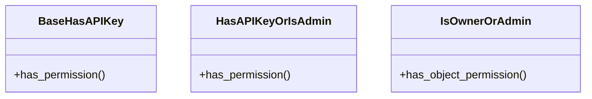

# core_modules.api_keys.permissions

## Imports
- rest_framework
- rest_framework_api_key.permissions

## Classes
- BaseHasAPIKey
  - method: `has_permission`
- HasAPIKeyOrIsAdmin
  - method: `has_permission`
- IsOwnerOrAdmin
  - method: `has_object_permission`

## Functions
- has_permission
- has_permission
- has_object_permission

## Class Diagram

