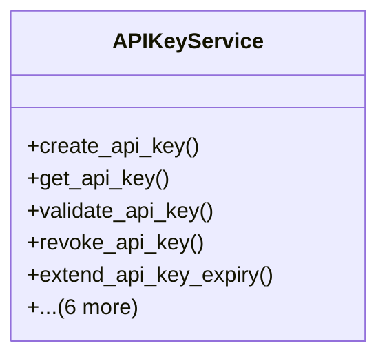

# core_modules.api_keys.services

## Imports
- django.core.exceptions
- django.utils
- django.utils.translation
- ipaddress
- models

## Classes
- APIKeyService
  - method: `create_api_key`
  - method: `get_api_key`
  - method: `validate_api_key`
  - method: `revoke_api_key`
  - method: `extend_api_key_expiry`
  - method: `log_api_key_usage`
  - method: `_get_client_ip`
  - method: `_is_ip_allowed`
  - method: `_is_referer_allowed`
  - method: `_get_request_data`
  - method: `_get_response_data`

## Functions
- create_api_key
- get_api_key
- validate_api_key
- revoke_api_key
- extend_api_key_expiry
- log_api_key_usage
- _get_client_ip
- _is_ip_allowed
- _is_referer_allowed
- _get_request_data
- _get_response_data

## Class Diagram

