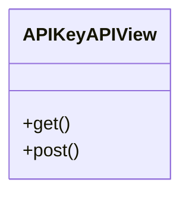

# core_modules.api_keys.views

## Imports
- django.http
- django.shortcuts
- models
- rest_framework
- rest_framework.decorators
- rest_framework.response
- rest_framework.views

## Classes
- APIKeyAPIView
  - method: `get`
  - method: `post`

## Functions
- api_key_list
- api_key_create
- api_key_detail
- api_key_revoke
- api_key_extend
- api_key_logs
- validate_api_key
- get
- post

## Module Variables
- `__all__`

## Class Diagram

