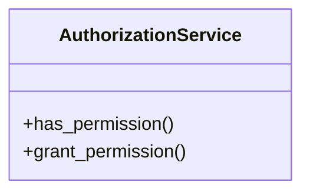

# core_modules.authorization_service

## Imports
- django.contrib.auth
- django.contrib.contenttypes.models
- django.utils
- json
- unified_permissions_model

## Classes
- AuthorizationService
  - method: `has_permission`
  - method: `grant_permission`

## Functions
- has_permission
- grant_permission

## Module Variables
- `User`

## Class Diagram

