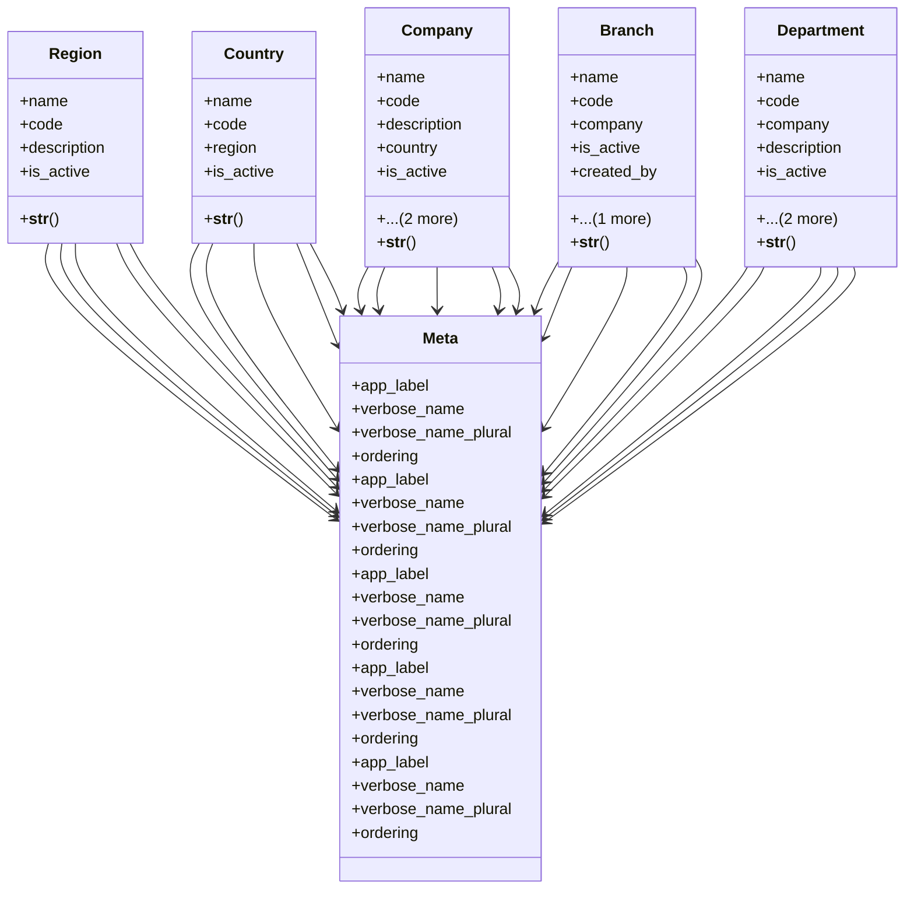

# core_modules.companies.models

## Imports
- django.conf
- django.core.validators
- django.db
- django.utils.translation

## Classes
- Region
  - attr: `name`
  - attr: `code`
  - attr: `description`
  - attr: `is_active`
  - method: `__str__`
- Country
  - attr: `name`
  - attr: `code`
  - attr: `region`
  - attr: `is_active`
  - method: `__str__`
- Company
  - attr: `name`
  - attr: `code`
  - attr: `description`
  - attr: `country`
  - attr: `is_active`
  - attr: `created_by`
  - attr: `updated_by`
  - method: `__str__`
- Branch
  - attr: `name`
  - attr: `code`
  - attr: `company`
  - attr: `is_active`
  - attr: `created_by`
  - attr: `updated_by`
  - method: `__str__`
- Department
  - attr: `name`
  - attr: `code`
  - attr: `company`
  - attr: `description`
  - attr: `is_active`
  - attr: `created_by`
  - attr: `updated_by`
  - method: `__str__`
- Meta
  - attr: `app_label`
  - attr: `verbose_name`
  - attr: `verbose_name_plural`
  - attr: `ordering`
- Meta
  - attr: `app_label`
  - attr: `verbose_name`
  - attr: `verbose_name_plural`
  - attr: `ordering`
- Meta
  - attr: `app_label`
  - attr: `verbose_name`
  - attr: `verbose_name_plural`
  - attr: `ordering`
- Meta
  - attr: `app_label`
  - attr: `verbose_name`
  - attr: `verbose_name_plural`
  - attr: `ordering`
- Meta
  - attr: `app_label`
  - attr: `verbose_name`
  - attr: `verbose_name_plural`
  - attr: `ordering`

## Functions
- __str__
- __str__
- __str__
- __str__
- __str__

## Class Diagram

