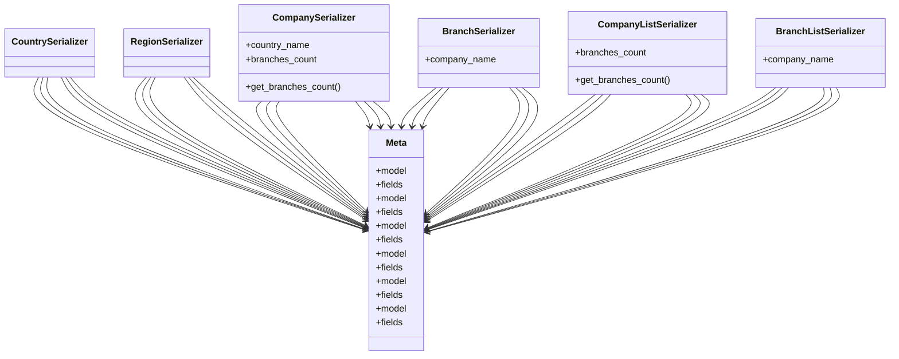

# core_modules.companies.serializers

## Imports
- models
- rest_framework

## Classes
- CountrySerializer
- RegionSerializer
- CompanySerializer
  - attr: `country_name`
  - attr: `branches_count`
  - method: `get_branches_count`
- BranchSerializer
  - attr: `company_name`
- CompanyListSerializer
  - attr: `branches_count`
  - method: `get_branches_count`
- BranchListSerializer
  - attr: `company_name`
- Meta
  - attr: `model`
  - attr: `fields`
- Meta
  - attr: `model`
  - attr: `fields`
- Meta
  - attr: `model`
  - attr: `fields`
- Meta
  - attr: `model`
  - attr: `fields`
- Meta
  - attr: `model`
  - attr: `fields`
- Meta
  - attr: `model`
  - attr: `fields`

## Functions
- get_branches_count
- get_branches_count

## Class Diagram

