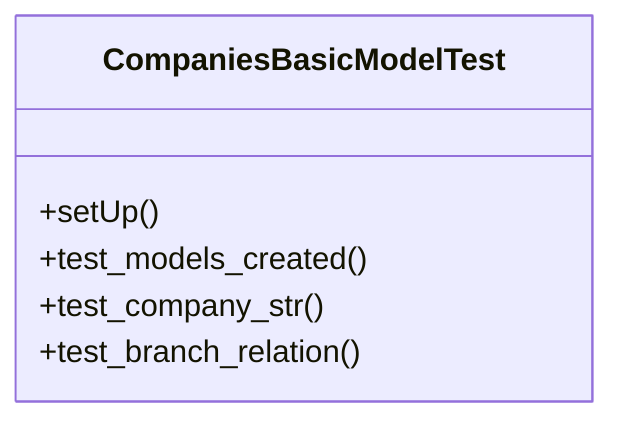

# core_modules.companies.tests.test_models_basic

## Imports
- django.test
- models

## Classes
- CompaniesBasicModelTest
  - method: `setUp`
  - method: `test_models_created`
  - method: `test_company_str`
  - method: `test_branch_relation`

## Functions
- setUp
- test_models_created
- test_company_str
- test_branch_relation

## Class Diagram

