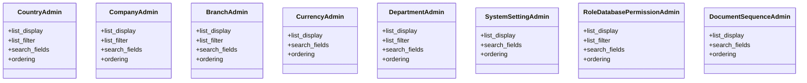

# core_modules.core.admin

## Imports
- django.contrib
- models

## Classes
- CountryAdmin
  - attr: `list_display`
  - attr: `list_filter`
  - attr: `search_fields`
  - attr: `ordering`
- CompanyAdmin
  - attr: `list_display`
  - attr: `list_filter`
  - attr: `search_fields`
  - attr: `ordering`
- BranchAdmin
  - attr: `list_display`
  - attr: `list_filter`
  - attr: `search_fields`
  - attr: `ordering`
- CurrencyAdmin
  - attr: `list_display`
  - attr: `search_fields`
  - attr: `ordering`
- DepartmentAdmin
  - attr: `list_display`
  - attr: `list_filter`
  - attr: `search_fields`
  - attr: `ordering`
- SystemSettingAdmin
  - attr: `list_display`
  - attr: `search_fields`
  - attr: `ordering`
- RoleDatabasePermissionAdmin
  - attr: `list_display`
  - attr: `list_filter`
  - attr: `search_fields`
  - attr: `ordering`
- DocumentSequenceAdmin
  - attr: `list_display`
  - attr: `search_fields`
  - attr: `ordering`

## Class Diagram

