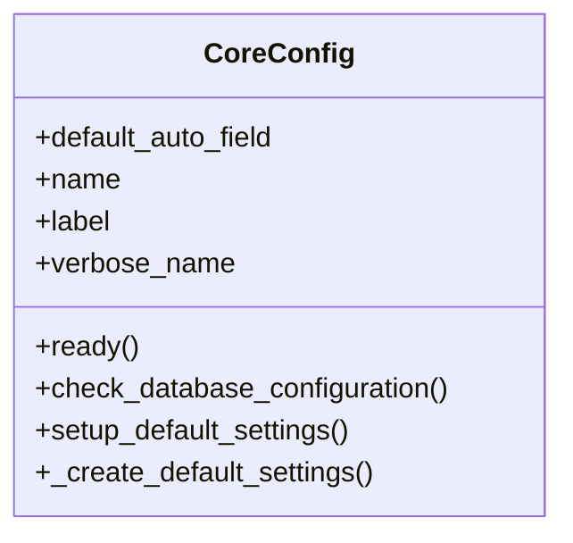

# core_modules.core.apps

## Imports
- django.apps
- django.conf
- django.db
- django.utils.translation
- logging
- models
- sys
- threading
- time

## Classes
- CoreConfig
  - attr: `default_auto_field`
  - attr: `name`
  - attr: `label`
  - attr: `verbose_name`
  - method: `ready`
  - method: `check_database_configuration`
  - method: `setup_default_settings`
  - method: `_create_default_settings`

## Functions
- ready
- check_database_configuration
- setup_default_settings
- _create_default_settings
- delayed_setup

## Class Diagram

