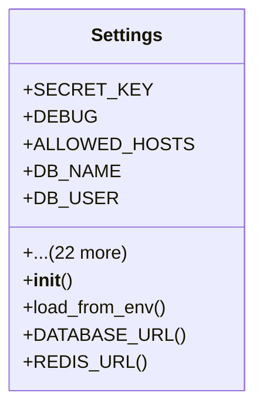

# core_modules.core.config

## Imports
- os
- pathlib
- typing

## Classes
- Settings
  - attr: `SECRET_KEY`
  - attr: `DEBUG`
  - attr: `ALLOWED_HOSTS`
  - attr: `DB_NAME`
  - attr: `DB_USER`
  - attr: `DB_PASSWORD`
  - attr: `DB_HOST`
  - attr: `DB_PORT`
  - attr: `REPLICA_DB_NAME`
  - attr: `REPLICA_DB_USER`
  - attr: `REPLICA_DB_PASSWORD`
  - attr: `REPLICA_DB_HOST`
  - attr: `REPLICA_DB_PORT`
  - attr: `REDIS_HOST`
  - attr: `REDIS_PORT`
  - attr: `REDIS_DB`
  - attr: `REDIS_PASSWORD`
  - attr: `EMAIL_HOST`
  - attr: `EMAIL_PORT`
  - attr: `EMAIL_USE_TLS`
  - attr: `EMAIL_HOST_USER`
  - attr: `EMAIL_HOST_PASSWORD`
  - attr: `CORS_ALLOWED_ORIGINS`
  - attr: `OPENAI_API_KEY`
  - attr: `ANTHROPIC_API_KEY`
  - attr: `MAX_UPLOAD_SIZE`
  - attr: `ALLOWED_FILE_TYPES`
  - method: `__init__`
  - method: `load_from_env`
  - method: `DATABASE_URL`
  - method: `REDIS_URL`

## Functions
- __init__
- load_from_env
- DATABASE_URL
- REDIS_URL

## Module Variables
- `BASE_DIR`
- `ENV_FILE_PATH`
- `settings`

## Class Diagram

