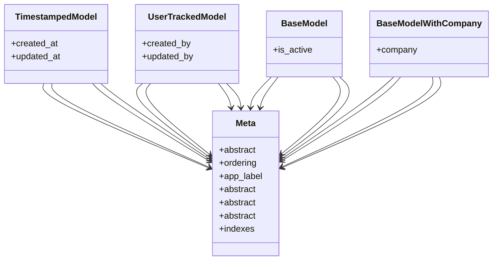

# core_modules.core.models.base_models

## Imports
- django.conf
- django.db
- django.utils.translation

## Classes
- TimestampedModel
  - attr: `created_at`
  - attr: `updated_at`
- UserTrackedModel
  - attr: `created_by`
  - attr: `updated_by`
- BaseModel
  - attr: `is_active`
- BaseModelWithCompany
  - attr: `company`
- Meta
  - attr: `abstract`
  - attr: `ordering`
- Meta
  - attr: `app_label`
  - attr: `abstract`
- Meta
  - attr: `abstract`
- Meta
  - attr: `abstract`
  - attr: `indexes`

## Class Diagram

