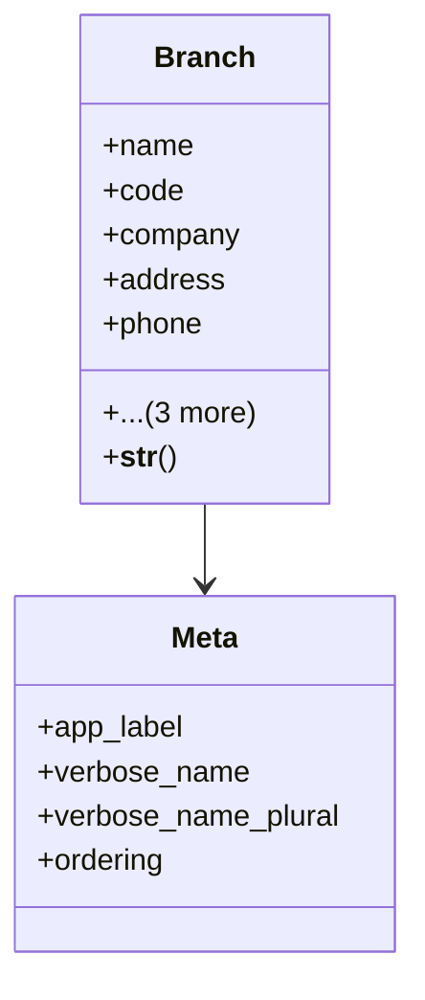

# core_modules.core.models.branch

## Imports
- base_models
- company
- country
- django.db
- django.utils.translation

## Classes
- Branch
  - attr: `name`
  - attr: `code`
  - attr: `company`
  - attr: `address`
  - attr: `phone`
  - attr: `email`
  - attr: `country`
  - attr: `is_active`
  - method: `__str__`
- Meta
  - attr: `app_label`
  - attr: `verbose_name`
  - attr: `verbose_name_plural`
  - attr: `ordering`

## Functions
- __str__

## Class Diagram

