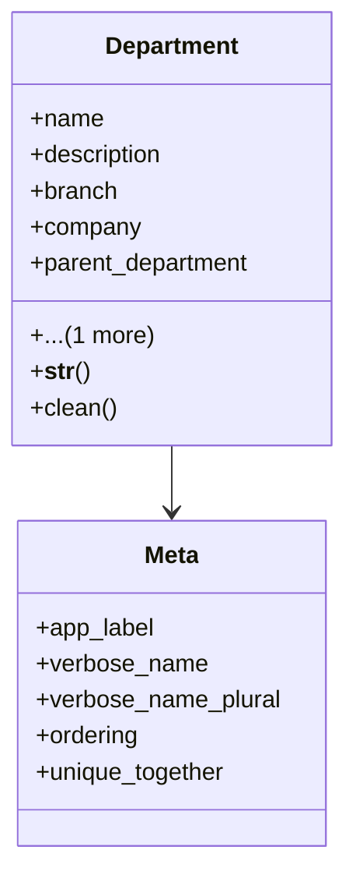

# core_modules.core.models.department

## Imports
- base_models
- branch
- company
- django.core.exceptions
- django.db
- django.utils.translation

## Classes
- Department
  - attr: `name`
  - attr: `description`
  - attr: `branch`
  - attr: `company`
  - attr: `parent_department`
  - attr: `is_active`
  - method: `__str__`
  - method: `clean`
- Meta
  - attr: `app_label`
  - attr: `verbose_name`
  - attr: `verbose_name_plural`
  - attr: `ordering`
  - attr: `unique_together`

## Functions
- __str__
- clean

## Class Diagram

