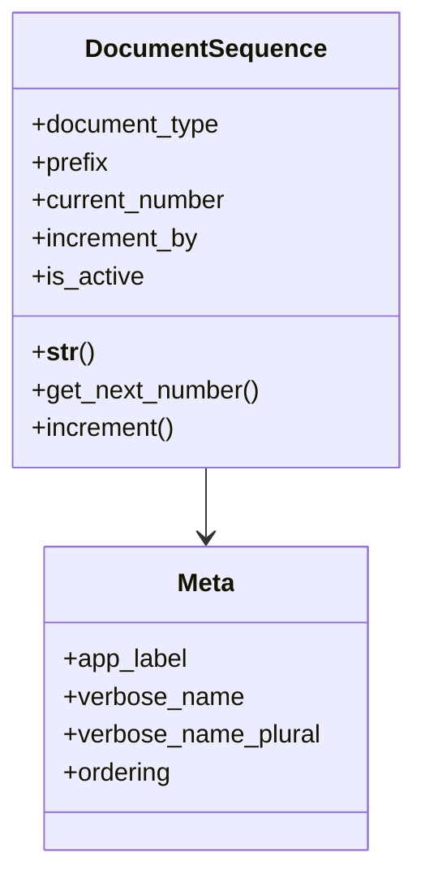

# core_modules.core.models.document_sequence

## Imports
- base_models
- django.db
- django.utils.translation

## Classes
- DocumentSequence
  - attr: `document_type`
  - attr: `prefix`
  - attr: `current_number`
  - attr: `increment_by`
  - attr: `is_active`
  - method: `__str__`
  - method: `get_next_number`
  - method: `increment`
- Meta
  - attr: `app_label`
  - attr: `verbose_name`
  - attr: `verbose_name_plural`
  - attr: `ordering`

## Functions
- __str__
- get_next_number
- increment

## Class Diagram

