# core_modules.core.models

## Imports
- decimal
- django.conf
- django.core.exceptions
- django.db
- django.utils.translation
- utils

## Classes
- TimestampedModel
  - attr: `created_at`
  - attr: `updated_at`
- UserTrackedModel
  - attr: `created_by`
  - attr: `updated_by`
- Country
  - attr: `name`
  - attr: `code`
  - attr: `is_active`
  - method: `__str__`
- Company
  - attr: `name`
  - attr: `code`
  - attr: `country`
  - attr: `registration_number`
  - attr: `vat_number`
  - attr: `logo`
  - attr: `is_active`
  - method: `__str__`
- Branch
  - attr: `name`
  - attr: `company`
  - attr: `address`
  - attr: `phone_number`
  - attr: `is_active`
  - method: `__str__`
- Currency
  - attr: `name`
  - attr: `code`
  - attr: `symbol`
  - attr: `exchange_rate`
  - attr: `is_base_currency`
  - attr: `is_active`
  - method: `__str__`
  - method: `save`
- Department
  - attr: `name`
  - attr: `branch`
  - attr: `company`
  - attr: `parent_department`
  - attr: `is_active`
  - method: `__str__`
  - method: `clean`
- SystemSetting
  - attr: `key`
  - attr: `value`
  - attr: `description`
  - method: `__str__`
- RoleDatabasePermission
  - attr: `database_alias`
  - attr: `can_access`
  - method: `__str__`
- DocumentSequence
  - attr: `name`
  - attr: `code`
  - attr: `prefix`
  - attr: `padding`
  - attr: `last_number`
  - attr: `company`
  - attr: `is_active`
  - method: `__str__`
  - method: `get_next_number`
- SlugTestModel
  - attr: `name`
  - attr: `slug`
  - method: `save`
  - method: `__str__`
- Meta
  - attr: `app_label`
  - attr: `abstract`
  - attr: `ordering`
- Meta
  - attr: `app_label`
  - attr: `abstract`
- Meta
  - attr: `app_label`
  - attr: `verbose_name`
  - attr: `verbose_name_plural`
  - attr: `ordering`
- Meta
  - attr: `app_label`
  - attr: `verbose_name`
  - attr: `verbose_name_plural`
  - attr: `ordering`
- Meta
  - attr: `app_label`
  - attr: `verbose_name`
  - attr: `verbose_name_plural`
  - attr: `ordering`
  - attr: `unique_together`
- Meta
  - attr: `app_label`
  - attr: `verbose_name`
  - attr: `verbose_name_plural`
  - attr: `ordering`
- Meta
  - attr: `app_label`
  - attr: `verbose_name`
  - attr: `verbose_name_plural`
  - attr: `ordering`
  - attr: `unique_together`
- Meta
  - attr: `app_label`
  - attr: `verbose_name`
  - attr: `verbose_name_plural`
  - attr: `ordering`
- Meta
  - attr: `app_label`
  - attr: `verbose_name`
  - attr: `verbose_name_plural`
  - attr: `ordering`
- Meta
  - attr: `app_label`
  - attr: `verbose_name`
  - attr: `verbose_name_plural`
  - attr: `ordering`
  - attr: `unique_together`
- Meta
  - attr: `app_label`

## Functions
- __str__
- __str__
- __str__
- __str__
- save
- __str__
- clean
- __str__
- __str__
- __str__
- get_next_number
- save
- __str__

## Class Diagram

```mermaid
classDiagram
    class TimestampedModel {
        +created_at
        +updated_at
    }
    class UserTrackedModel {
        +created_by
        +updated_by
    }
    class Country {
        +name
        +code
        +is_active
        +__str__()
    }
    class Company {
        +name
        +code
        +country
        +registration_number
        +vat_number
        +... (2 more)
        +__str__()
    }
    class Branch {
        +name
        +company
        +address
        +phone_number
        +is_active
        +__str__()
    }
    class Currency {
        +name
        +code
        +symbol
        +exchange_rate
        +is_base_currency
        +... (1 more)
        +__str__()
        +save()
    }
    class Department {
        +name
        +branch
        +company
        +parent_department
        +is_active
        +__str__()
        +clean()
    }
    class SystemSetting {
        +key
        +value
        +description
        +__str__()
    }
    class RoleDatabasePermission {
        +database_alias
        +can_access
        +__str__()
    }
    class DocumentSequence {
        +name
        +code
        +prefix
        +padding
        +last_number
        +... (2 more)
        +__str__()
        +get_next_number()
    }
    class SlugTestModel {
        +name
        +slug
        +save()
        +__str__()
    }
    class Meta {
        +app_label
        +abstract
        +ordering
    }
    class Meta {
        +app_label
        +abstract
    }
    class Meta {
        +app_label
        +verbose_name
        +verbose_name_plural
        +ordering
    }
    class Meta {
        +app_label
        +verbose_name
        +verbose_name_plural
        +ordering
    }
    class Meta {
        +app_label
        +verbose_name
        +verbose_name_plural
        +ordering
        +unique_together
    }
    class Meta {
        +app_label
        +verbose_name
        +verbose_name_plural
        +ordering
    }
    class Meta {
        +app_label
        +verbose_name
        +verbose_name_plural
        +ordering
        +unique_together
    }
    class Meta {
        +app_label
        +verbose_name
        +verbose_name_plural
        +ordering
    }
    class Meta {
        +app_label
        +verbose_name
        +verbose_name_plural
        +ordering
    }
    class Meta {
        +app_label
        +verbose_name
        +verbose_name_plural
        +ordering
        +unique_together
    }
    class Meta {
        +app_label
    }
    TimestampedModel --> Meta
    TimestampedModel --> Meta
    TimestampedModel --> Meta
    TimestampedModel --> Meta
    TimestampedModel --> Meta
    TimestampedModel --> Meta
    TimestampedModel --> Meta
    TimestampedModel --> Meta
    TimestampedModel --> Meta
    TimestampedModel --> Meta
    TimestampedModel --> Meta
    UserTrackedModel --> Meta
    UserTrackedModel --> Meta
    UserTrackedModel --> Meta
    UserTrackedModel --> Meta
    UserTrackedModel --> Meta
    UserTrackedModel --> Meta
    UserTrackedModel --> Meta
    UserTrackedModel --> Meta
    UserTrackedModel --> Meta
    UserTrackedModel --> Meta
    UserTrackedModel --> Meta
    Country --> Meta
    Country --> Meta
    Country --> Meta
    Country --> Meta
    Country --> Meta
    Country --> Meta
    Country --> Meta
    Country --> Meta
    Country --> Meta
    Country --> Meta
    Country --> Meta
    Company --> Meta
    Company --> Meta
    Company --> Meta
    Company --> Meta
    Company --> Meta
    Company --> Meta
    Company --> Meta
    Company --> Meta
    Company --> Meta
    Company --> Meta
    Company --> Meta
    Branch --> Meta
    Branch --> Meta
    Branch --> Meta
    Branch --> Meta
    Branch --> Meta
    Branch --> Meta
    Branch --> Meta
    Branch --> Meta
    Branch --> Meta
    Branch --> Meta
    Branch --> Meta
    Currency --> Meta
    Currency --> Meta
    Currency --> Meta
    Currency --> Meta
    Currency --> Meta
    Currency --> Meta
    Currency --> Meta
    Currency --> Meta
    Currency --> Meta
    Currency --> Meta
    Currency --> Meta
    Department --> Meta
    Department --> Meta
    Department --> Meta
    Department --> Meta
    Department --> Meta
    Department --> Meta
    Department --> Meta
    Department --> Meta
    Department --> Meta
    Department --> Meta
    Department --> Meta
    SystemSetting --> Meta
    SystemSetting --> Meta
    SystemSetting --> Meta
    SystemSetting --> Meta
    SystemSetting --> Meta
    SystemSetting --> Meta
    SystemSetting --> Meta
    SystemSetting --> Meta
    SystemSetting --> Meta
    SystemSetting --> Meta
    SystemSetting --> Meta
    RoleDatabasePermission --> Meta
    RoleDatabasePermission --> Meta
    RoleDatabasePermission --> Meta
    RoleDatabasePermission --> Meta
    RoleDatabasePermission --> Meta
    RoleDatabasePermission --> Meta
    RoleDatabasePermission --> Meta
    RoleDatabasePermission --> Meta
    RoleDatabasePermission --> Meta
    RoleDatabasePermission --> Meta
    RoleDatabasePermission --> Meta
    DocumentSequence --> Meta
    DocumentSequence --> Meta
    DocumentSequence --> Meta
    DocumentSequence --> Meta
    DocumentSequence --> Meta
    DocumentSequence --> Meta
    DocumentSequence --> Meta
    DocumentSequence --> Meta
    DocumentSequence --> Meta
    DocumentSequence --> Meta
    DocumentSequence --> Meta
    SlugTestModel --> Meta
    SlugTestModel --> Meta
    SlugTestModel --> Meta
    SlugTestModel --> Meta
    SlugTestModel --> Meta
    SlugTestModel --> Meta
    SlugTestModel --> Meta
    SlugTestModel --> Meta
    SlugTestModel --> Meta
    SlugTestModel --> Meta
    SlugTestModel --> Meta
```

