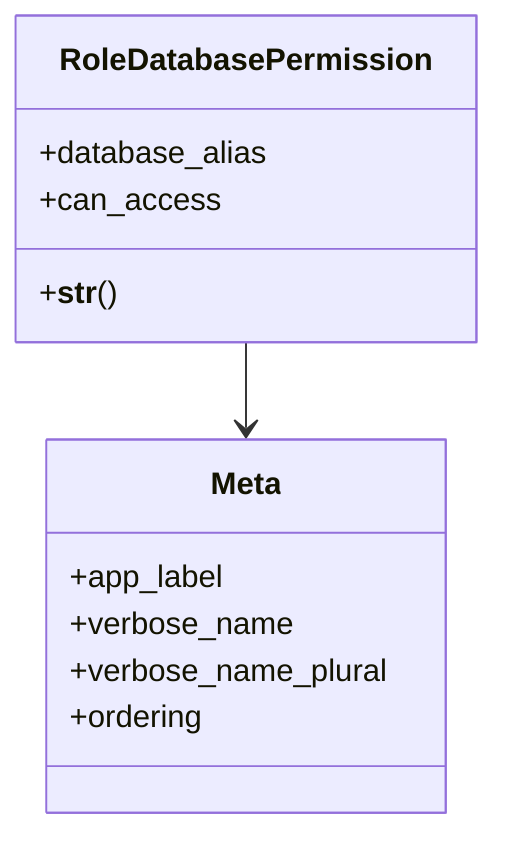

# core_modules.core.models.role_database_permission

## Imports
- base_models
- django.db
- django.utils.translation

## Classes
- RoleDatabasePermission
  - attr: `database_alias`
  - attr: `can_access`
  - method: `__str__`
- Meta
  - attr: `app_label`
  - attr: `verbose_name`
  - attr: `verbose_name_plural`
  - attr: `ordering`

## Functions
- __str__

## Class Diagram

