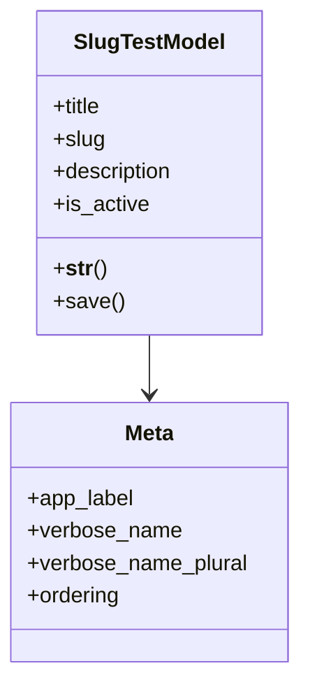

# core_modules.core.models.slug_test_model

## Imports
- base_models
- django.db
- django.utils.text
- django.utils.translation

## Classes
- SlugTestModel
  - attr: `title`
  - attr: `slug`
  - attr: `description`
  - attr: `is_active`
  - method: `__str__`
  - method: `save`
- Meta
  - attr: `app_label`
  - attr: `verbose_name`
  - attr: `verbose_name_plural`
  - attr: `ordering`

## Functions
- __str__
- save

## Class Diagram

