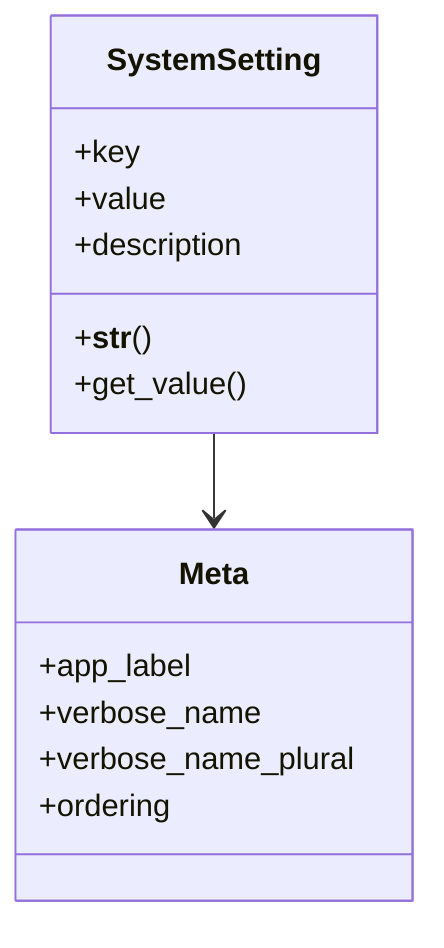

# core_modules.core.models.system_setting

## Imports
- base_models
- django.db
- django.utils.translation

## Classes
- SystemSetting
  - attr: `key`
  - attr: `value`
  - attr: `description`
  - method: `__str__`
  - method: `get_value`
- Meta
  - attr: `app_label`
  - attr: `verbose_name`
  - attr: `verbose_name_plural`
  - attr: `ordering`

## Functions
- __str__
- get_value

## Class Diagram

