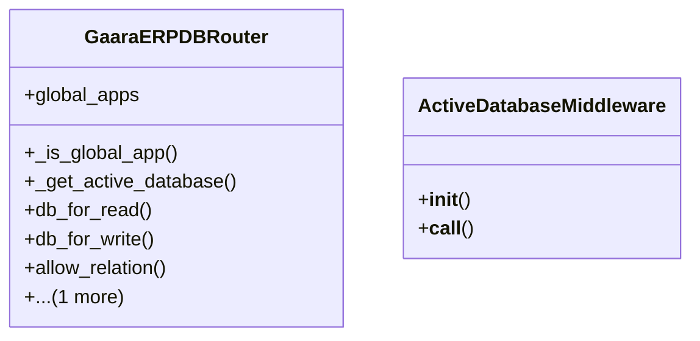

# core_modules.core.routers

## Imports
- django.conf
- thread_locals

## Classes
- GaaraERPDBRouter
  - attr: `global_apps`
  - method: `_is_global_app`
  - method: `_get_active_database`
  - method: `db_for_read`
  - method: `db_for_write`
  - method: `allow_relation`
  - method: `allow_migrate`
- ActiveDatabaseMiddleware
  - method: `__init__`
  - method: `__call__`

## Functions
- _is_global_app
- _get_active_database
- db_for_read
- db_for_write
- allow_relation
- allow_migrate
- __init__
- __call__

## Class Diagram

