# core_modules.core.serializers

## Imports
- django.conf
- django.contrib.auth
- models
- rest_framework

## Classes
- UserSummarySerializer
- CountrySerializer
  - method: `validate_code`
- CompanySerializer
  - attr: `country_detail`
  - attr: `created_by_detail`
  - attr: `updated_by_detail`
- BranchSerializer
  - attr: `company_detail`
  - attr: `created_by_detail`
  - attr: `updated_by_detail`
  - method: `validate`
- CurrencySerializer
  - method: `validate_code`
  - method: `validate`
- DepartmentSerializer
  - attr: `company_detail`
  - attr: `branch_detail`
  - attr: `parent_department_detail`
  - attr: `children_count`
  - attr: `created_by_detail`
  - attr: `updated_by_detail`
  - method: `get_parent_department_detail`
  - method: `get_children_count`
  - method: `validate`
  - method: `_would_create_cycle`
- SystemSettingSerializer
  - method: `validate_key`
- RoleDatabasePermissionSerializer
  - attr: `created_by_detail`
  - attr: `updated_by_detail`
  - method: `validate_database_alias`
- DocumentSequenceSerializer
  - attr: `company_detail`
  - attr: `created_by_detail`
  - attr: `updated_by_detail`
  - attr: `next_number_preview`
  - method: `get_next_number_preview`
  - method: `validate_code`
  - method: `validate_padding`
  - method: `validate`
- Meta
  - attr: `model`
  - attr: `fields`
  - attr: `read_only_fields`
- Meta
  - attr: `model`
  - attr: `fields`
  - attr: `read_only_fields`
- Meta
  - attr: `model`
  - attr: `fields`
  - attr: `read_only_fields`
- Meta
  - attr: `model`
  - attr: `fields`
  - attr: `read_only_fields`
- Meta
  - attr: `model`
  - attr: `fields`
  - attr: `read_only_fields`
- Meta
  - attr: `model`
  - attr: `fields`
  - attr: `read_only_fields`
- Meta
  - attr: `model`
  - attr: `fields`
  - attr: `read_only_fields`
- Meta
  - attr: `model`
  - attr: `fields`
  - attr: `read_only_fields`
- Meta
  - attr: `model`
  - attr: `fields`
  - attr: `read_only_fields`

## Functions
- validate_code
- validate
- validate_code
- validate
- get_parent_department_detail
- get_children_count
- validate
- _would_create_cycle
- validate_key
- validate_database_alias
- get_next_number_preview
- validate_code
- validate_padding
- validate

## Module Variables
- `User`

## Class Diagram

```mermaid
classDiagram
    class UserSummarySerializer {
    }
    class CountrySerializer {
        +validate_code()
    }
    class CompanySerializer {
        +country_detail
        +created_by_detail
        +updated_by_detail
    }
    class BranchSerializer {
        +company_detail
        +created_by_detail
        +updated_by_detail
        +validate()
    }
    class CurrencySerializer {
        +validate_code()
        +validate()
    }
    class DepartmentSerializer {
        +company_detail
        +branch_detail
        +parent_department_detail
        +children_count
        +created_by_detail
        +... (1 more)
        +get_parent_department_detail()
        +get_children_count()
        +validate()
        +_would_create_cycle()
    }
    class SystemSettingSerializer {
        +validate_key()
    }
    class RoleDatabasePermissionSerializer {
        +created_by_detail
        +updated_by_detail
        +validate_database_alias()
    }
    class DocumentSequenceSerializer {
        +company_detail
        +created_by_detail
        +updated_by_detail
        +next_number_preview
        +get_next_number_preview()
        +validate_code()
        +validate_padding()
        +validate()
    }
    class Meta {
        +model
        +fields
        +read_only_fields
    }
    class Meta {
        +model
        +fields
        +read_only_fields
    }
    class Meta {
        +model
        +fields
        +read_only_fields
    }
    class Meta {
        +model
        +fields
        +read_only_fields
    }
    class Meta {
        +model
        +fields
        +read_only_fields
    }
    class Meta {
        +model
        +fields
        +read_only_fields
    }
    class Meta {
        +model
        +fields
        +read_only_fields
    }
    class Meta {
        +model
        +fields
        +read_only_fields
    }
    class Meta {
        +model
        +fields
        +read_only_fields
    }
    UserSummarySerializer --> Meta
    UserSummarySerializer --> Meta
    UserSummarySerializer --> Meta
    UserSummarySerializer --> Meta
    UserSummarySerializer --> Meta
    UserSummarySerializer --> Meta
    UserSummarySerializer --> Meta
    UserSummarySerializer --> Meta
    UserSummarySerializer --> Meta
    CountrySerializer --> Meta
    CountrySerializer --> Meta
    CountrySerializer --> Meta
    CountrySerializer --> Meta
    CountrySerializer --> Meta
    CountrySerializer --> Meta
    CountrySerializer --> Meta
    CountrySerializer --> Meta
    CountrySerializer --> Meta
    CompanySerializer --> Meta
    CompanySerializer --> Meta
    CompanySerializer --> Meta
    CompanySerializer --> Meta
    CompanySerializer --> Meta
    CompanySerializer --> Meta
    CompanySerializer --> Meta
    CompanySerializer --> Meta
    CompanySerializer --> Meta
    BranchSerializer --> Meta
    BranchSerializer --> Meta
    BranchSerializer --> Meta
    BranchSerializer --> Meta
    BranchSerializer --> Meta
    BranchSerializer --> Meta
    BranchSerializer --> Meta
    BranchSerializer --> Meta
    BranchSerializer --> Meta
    CurrencySerializer --> Meta
    CurrencySerializer --> Meta
    CurrencySerializer --> Meta
    CurrencySerializer --> Meta
    CurrencySerializer --> Meta
    CurrencySerializer --> Meta
    CurrencySerializer --> Meta
    CurrencySerializer --> Meta
    CurrencySerializer --> Meta
    DepartmentSerializer --> Meta
    DepartmentSerializer --> Meta
    DepartmentSerializer --> Meta
    DepartmentSerializer --> Meta
    DepartmentSerializer --> Meta
    DepartmentSerializer --> Meta
    DepartmentSerializer --> Meta
    DepartmentSerializer --> Meta
    DepartmentSerializer --> Meta
    SystemSettingSerializer --> Meta
    SystemSettingSerializer --> Meta
    SystemSettingSerializer --> Meta
    SystemSettingSerializer --> Meta
    SystemSettingSerializer --> Meta
    SystemSettingSerializer --> Meta
    SystemSettingSerializer --> Meta
    SystemSettingSerializer --> Meta
    SystemSettingSerializer --> Meta
    RoleDatabasePermissionSerializer --> Meta
    RoleDatabasePermissionSerializer --> Meta
    RoleDatabasePermissionSerializer --> Meta
    RoleDatabasePermissionSerializer --> Meta
    RoleDatabasePermissionSerializer --> Meta
    RoleDatabasePermissionSerializer --> Meta
    RoleDatabasePermissionSerializer --> Meta
    RoleDatabasePermissionSerializer --> Meta
    RoleDatabasePermissionSerializer --> Meta
    DocumentSequenceSerializer --> Meta
    DocumentSequenceSerializer --> Meta
    DocumentSequenceSerializer --> Meta
    DocumentSequenceSerializer --> Meta
    DocumentSequenceSerializer --> Meta
    DocumentSequenceSerializer --> Meta
    DocumentSequenceSerializer --> Meta
    DocumentSequenceSerializer --> Meta
    DocumentSequenceSerializer --> Meta
```

