# core_modules.core.tests.test_core

## Imports
- core_modules.core.models
- core_modules.permissions.models
- core_modules.users_accounts.models
- django.db
- django.test

## Classes
- PermissionModelTest
  - method: `setUp`
  - method: `test_create_permission`
  - method: `test_unique_code`
- RoleModelTest
  - method: `setUp`
  - method: `test_create_role`
  - method: `test_unique_code`
  - method: `test_add_permissions_to_role`
  - method: `test_remove_permission_from_role`
- UserModelTest
  - method: `setUp`
  - method: `test_create_user`
  - method: `test_create_superuser`
  - method: `test_add_roles_to_user`
  - method: `test_get_full_name`
  - method: `test_has_permission`
- CompanyModelTest
  - method: `setUp`
  - method: `test_create_company`
  - method: `test_unique_code`
  - method: `test_deactivate_company`
- BranchModelTest
  - method: `setUp`
  - method: `test_create_branch`
  - method: `test_unique_code_per_company`
  - method: `test_deactivate_branch`
- OrganizationModelTest
  - method: `test_organization_skipped`
- SettingCategoryModelTest
  - method: `test_setting_category_skipped`
- SystemSettingModelTest
  - method: `setUp`
  - method: `test_create_system_setting`
  - method: `test_unique_key`
  - method: `test_get_setting_value`
  - method: `test_deactivate_setting`

## Functions
- setUp
- test_create_permission
- test_unique_code
- setUp
- test_create_role
- test_unique_code
- test_add_permissions_to_role
- test_remove_permission_from_role
- setUp
- test_create_user
- test_create_superuser
- test_add_roles_to_user
- test_get_full_name
- test_has_permission
- setUp
- test_create_company
- test_unique_code
- test_deactivate_company
- setUp
- test_create_branch
- test_unique_code_per_company
- test_deactivate_branch
- test_organization_skipped
- test_setting_category_skipped
- setUp
- test_create_system_setting
- test_unique_key
- test_get_setting_value
- test_deactivate_setting
- mock_get_full_name
- _mock_user_has_perm

## Class Diagram

```mermaid
classDiagram
    class PermissionModelTest {
        +setUp()
        +test_create_permission()
        +test_unique_code()
    }
    class RoleModelTest {
        +setUp()
        +test_create_role()
        +test_unique_code()
        +test_add_permissions_to_role()
        +test_remove_permission_from_role()
    }
    class UserModelTest {
        +setUp()
        +test_create_user()
        +test_create_superuser()
        +test_add_roles_to_user()
        +test_get_full_name()
        +... (1 more)
    }
    class CompanyModelTest {
        +setUp()
        +test_create_company()
        +test_unique_code()
        +test_deactivate_company()
    }
    class BranchModelTest {
        +setUp()
        +test_create_branch()
        +test_unique_code_per_company()
        +test_deactivate_branch()
    }
    class OrganizationModelTest {
        +test_organization_skipped()
    }
    class SettingCategoryModelTest {
        +test_setting_category_skipped()
    }
    class SystemSettingModelTest {
        +setUp()
        +test_create_system_setting()
        +test_unique_key()
        +test_get_setting_value()
        +test_deactivate_setting()
    }
```

