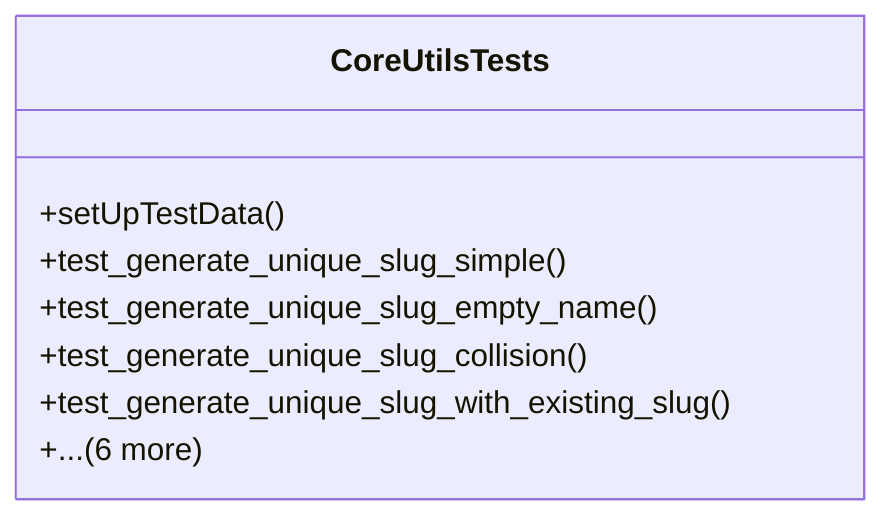

# core_modules.core.tests.test_utils

## Imports
- django.contrib.auth
- django.test
- models
- utils

## Classes
- CoreUtilsTests
  - method: `setUpTestData`
  - method: `test_generate_unique_slug_simple`
  - method: `test_generate_unique_slug_empty_name`
  - method: `test_generate_unique_slug_collision`
  - method: `test_generate_unique_slug_with_existing_slug`
  - method: `test_get_document_next_sequence_invoice`
  - method: `test_get_document_next_sequence_sales_order`
  - method: `test_get_document_next_sequence_non_existent`
  - method: `test_get_document_next_sequence_inactive`
  - method: `test_get_document_next_sequence_no_company`
  - method: `test_slug_model_save_integration`

## Functions
- setUpTestData
- test_generate_unique_slug_simple
- test_generate_unique_slug_empty_name
- test_generate_unique_slug_collision
- test_generate_unique_slug_with_existing_slug
- test_get_document_next_sequence_invoice
- test_get_document_next_sequence_sales_order
- test_get_document_next_sequence_non_existent
- test_get_document_next_sequence_inactive
- test_get_document_next_sequence_no_company
- test_slug_model_save_integration

## Module Variables
- `User`

## Class Diagram

