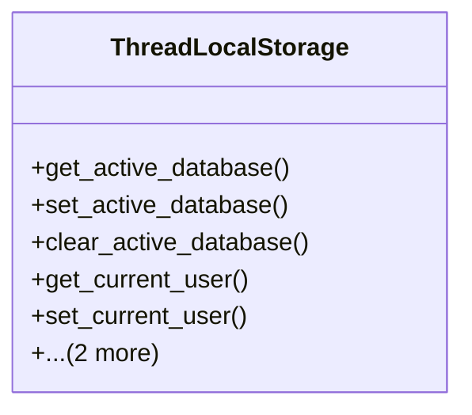

# core_modules.core.tests.thread_locals

## Imports
- contextlib
- threading

## Classes
- ThreadLocalStorage
  - method: `get_active_database`
  - method: `set_active_database`
  - method: `clear_active_database`
  - method: `get_current_user`
  - method: `set_current_user`
  - method: `clear_current_user`
  - method: `clear_all`

## Functions
- use_database
- as_user
- get_active_database
- set_active_database
- clear_active_database
- get_current_user
- set_current_user
- clear_current_user
- clear_all

## Module Variables
- `_thread_locals`
- `get_current_database`
- `set_current_database`
- `get_current_user`
- `set_current_user`

## Class Diagram

