# core_modules.core.views

## Imports
- django.core.exceptions
- django.db
- logging
- models
- rest_framework
- rest_framework.decorators
- rest_framework.response
- serializers

## Classes
- CoreModelViewSet
  - attr: `permission_classes`
  - method: `perform_create`
  - method: `perform_update`
- CountryViewSet
  - attr: `queryset`
  - attr: `serializer_class`
  - attr: `filterset_fields`
  - attr: `search_fields`
- CompanyViewSet
  - attr: `queryset`
  - attr: `serializer_class`
  - attr: `filterset_fields`
  - attr: `search_fields`
- BranchViewSet
  - attr: `queryset`
  - attr: `serializer_class`
  - attr: `filterset_fields`
  - attr: `search_fields`
- CurrencyViewSet
  - attr: `queryset`
  - attr: `serializer_class`
  - attr: `filterset_fields`
  - attr: `search_fields`
  - method: `set_as_base`
- DepartmentViewSet
  - attr: `queryset`
  - attr: `serializer_class`
  - attr: `filterset_fields`
  - attr: `search_fields`
  - method: `hierarchy`
- SystemSettingViewSet
  - attr: `queryset`
  - attr: `serializer_class`
  - attr: `lookup_field`
  - attr: `search_fields`
  - method: `by_prefix`
- PublicCountryViewSet
  - attr: `queryset`
  - attr: `serializer_class`
  - attr: `permission_classes`
  - attr: `filterset_fields`
  - attr: `search_fields`
- PublicCompanyViewSet
  - attr: `queryset`
  - attr: `serializer_class`
  - attr: `permission_classes`
  - attr: `filterset_fields`
  - attr: `search_fields`
- PublicCurrencyViewSet
  - attr: `queryset`
  - attr: `serializer_class`
  - attr: `permission_classes`
  - attr: `filterset_fields`
  - attr: `search_fields`
- RoleDatabasePermissionViewSet
  - attr: `queryset`
  - attr: `serializer_class`
  - attr: `filterset_fields`
  - attr: `search_fields`
- DocumentSequenceViewSet
  - attr: `queryset`
  - attr: `serializer_class`
  - attr: `filterset_fields`
  - attr: `search_fields`
  - method: `get_next_number`
  - method: `reset`
  - method: `by_company`

## Functions
- perform_create
- perform_update
- set_as_base
- hierarchy
- by_prefix
- get_next_number
- reset
- by_company
- get_hierarchy

## Module Variables
- `logger`

## Class Diagram

```mermaid
classDiagram
    class CoreModelViewSet {
        +permission_classes
        +perform_create()
        +perform_update()
    }
    class CountryViewSet {
        +queryset
        +serializer_class
        +filterset_fields
        +search_fields
    }
    class CompanyViewSet {
        +queryset
        +serializer_class
        +filterset_fields
        +search_fields
    }
    class BranchViewSet {
        +queryset
        +serializer_class
        +filterset_fields
        +search_fields
    }
    class CurrencyViewSet {
        +queryset
        +serializer_class
        +filterset_fields
        +search_fields
        +set_as_base()
    }
    class DepartmentViewSet {
        +queryset
        +serializer_class
        +filterset_fields
        +search_fields
        +hierarchy()
    }
    class SystemSettingViewSet {
        +queryset
        +serializer_class
        +lookup_field
        +search_fields
        +by_prefix()
    }
    class PublicCountryViewSet {
        +queryset
        +serializer_class
        +permission_classes
        +filterset_fields
        +search_fields
    }
    class PublicCompanyViewSet {
        +queryset
        +serializer_class
        +permission_classes
        +filterset_fields
        +search_fields
    }
    class PublicCurrencyViewSet {
        +queryset
        +serializer_class
        +permission_classes
        +filterset_fields
        +search_fields
    }
    class RoleDatabasePermissionViewSet {
        +queryset
        +serializer_class
        +filterset_fields
        +search_fields
    }
    class DocumentSequenceViewSet {
        +queryset
        +serializer_class
        +filterset_fields
        +search_fields
        +get_next_number()
        +reset()
        +by_company()
    }
```

