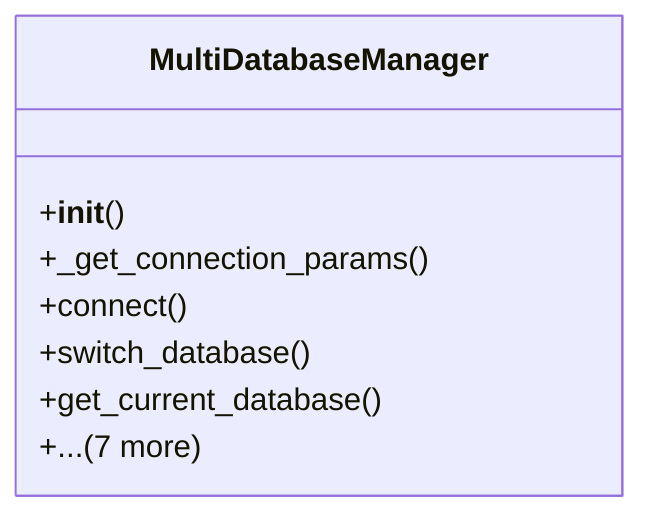

# core_modules.database_manager

## Imports
- datetime
- django.conf
- django.db
- dotenv
- logging
- os
- pathlib
- psycopg2
- subprocess

## Classes
- MultiDatabaseManager
  - method: `__init__`
  - method: `_get_connection_params`
  - method: `connect`
  - method: `switch_database`
  - method: `get_current_database`
  - method: `backup_database`
  - method: `restore_database`
  - method: `list_backups`
  - method: `export_data`
  - method: `import_data`
  - method: `close_all_connections`
  - method: `__del__`

## Functions
- __init__
- _get_connection_params
- connect
- switch_database
- get_current_database
- backup_database
- restore_database
- list_backups
- export_data
- import_data
- close_all_connections
- __del__

## Module Variables
- `logger`
- `db_manager`

## Class Diagram

