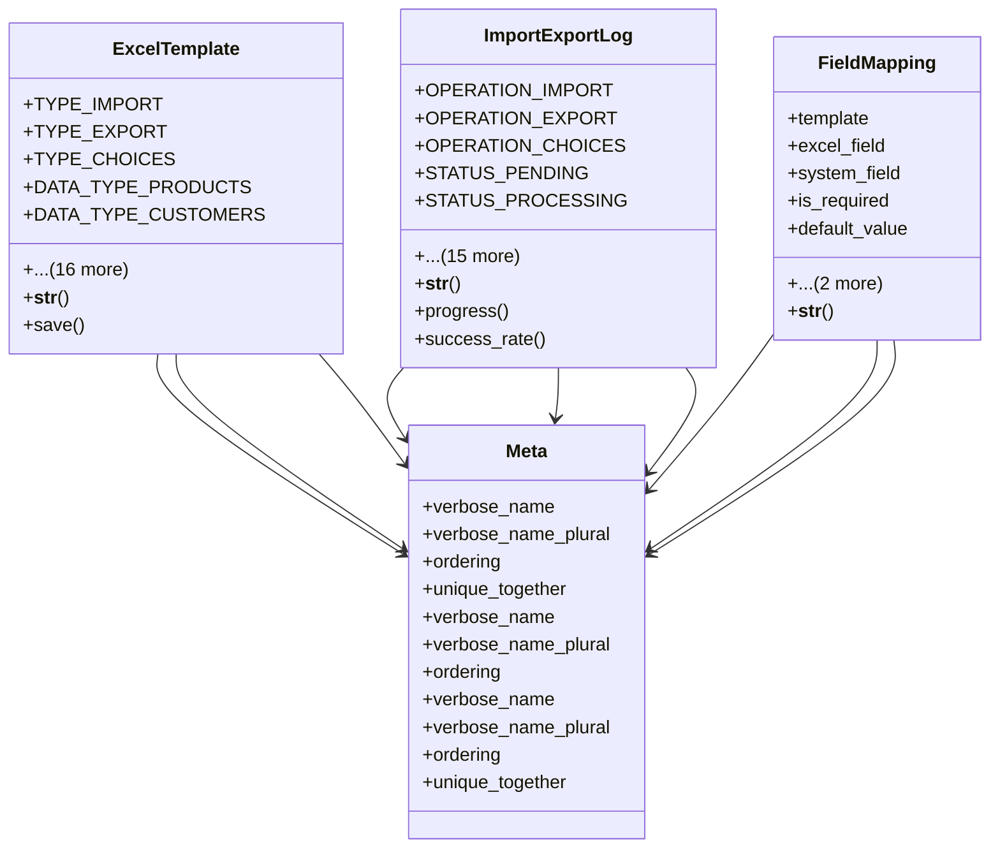

# core_modules.master_data_excel.models

## Imports
- companies.models
- core.models
- django.core.validators
- django.db
- django.utils.translation
- users.models

## Classes
- ExcelTemplate
  - attr: `TYPE_IMPORT`
  - attr: `TYPE_EXPORT`
  - attr: `TYPE_CHOICES`
  - attr: `DATA_TYPE_PRODUCTS`
  - attr: `DATA_TYPE_CUSTOMERS`
  - attr: `DATA_TYPE_SUPPLIERS`
  - attr: `DATA_TYPE_EMPLOYEES`
  - attr: `DATA_TYPE_INVENTORY`
  - attr: `DATA_TYPE_CHART_OF_ACCOUNTS`
  - attr: `DATA_TYPE_CUSTOM`
  - attr: `DATA_TYPE_CHOICES`
  - attr: `name`
  - attr: `description`
  - attr: `type`
  - attr: `data_type`
  - attr: `file`
  - attr: `header_row`
  - attr: `data_start_row`
  - attr: `sheet_name`
  - attr: `mapping`
  - attr: `is_default`
  - method: `__str__`
  - method: `save`
- ImportExportLog
  - attr: `OPERATION_IMPORT`
  - attr: `OPERATION_EXPORT`
  - attr: `OPERATION_CHOICES`
  - attr: `STATUS_PENDING`
  - attr: `STATUS_PROCESSING`
  - attr: `STATUS_COMPLETED`
  - attr: `STATUS_FAILED`
  - attr: `STATUS_CHOICES`
  - attr: `template`
  - attr: `operation`
  - attr: `status`
  - attr: `file`
  - attr: `result_file`
  - attr: `total_rows`
  - attr: `processed_rows`
  - attr: `successful_rows`
  - attr: `failed_rows`
  - attr: `errors`
  - attr: `started_at`
  - attr: `completed_at`
  - method: `__str__`
  - method: `progress`
  - method: `success_rate`
- FieldMapping
  - attr: `template`
  - attr: `excel_field`
  - attr: `system_field`
  - attr: `is_required`
  - attr: `default_value`
  - attr: `column_index`
  - attr: `transformation`
  - method: `__str__`
- Meta
  - attr: `verbose_name`
  - attr: `verbose_name_plural`
  - attr: `ordering`
  - attr: `unique_together`
- Meta
  - attr: `verbose_name`
  - attr: `verbose_name_plural`
  - attr: `ordering`
- Meta
  - attr: `verbose_name`
  - attr: `verbose_name_plural`
  - attr: `ordering`
  - attr: `unique_together`

## Functions
- __str__
- save
- __str__
- progress
- success_rate
- __str__

## Class Diagram

