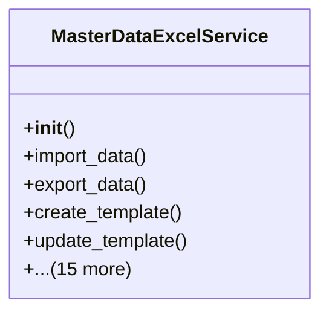

# core_modules.master_data_excel.services

## Imports
- accounting.models
- customers.models
- datetime
- django.core.files.base
- django.db
- django.utils
- django.utils.translation
- employees.models
- inventory.models
- models
- numpy
- os
- pandas
- products.models
- suppliers.models

## Classes
- MasterDataExcelService
  - method: `__init__`
  - method: `import_data`
  - method: `export_data`
  - method: `create_template`
  - method: `update_template`
  - method: `delete_template`
  - method: `get_template`
  - method: `get_templates`
  - method: `get_default_template`
  - method: `_handle_products`
  - method: `_handle_customers`
  - method: `_handle_suppliers`
  - method: `_handle_employees`
  - method: `_handle_inventory`
  - method: `_handle_chart_of_accounts`
  - method: `_handle_custom`
  - method: `_get_export_handler`
  - method: `_export_products`
  - method: `_export_customers`
  - method: `_apply_transformation`

## Functions
- __init__
- import_data
- export_data
- create_template
- update_template
- delete_template
- get_template
- get_templates
- get_default_template
- _handle_products
- _handle_customers
- _handle_suppliers
- _handle_employees
- _handle_inventory
- _handle_chart_of_accounts
- _handle_custom
- _get_export_handler
- _export_products
- _export_customers
- _apply_transformation

## Class Diagram

