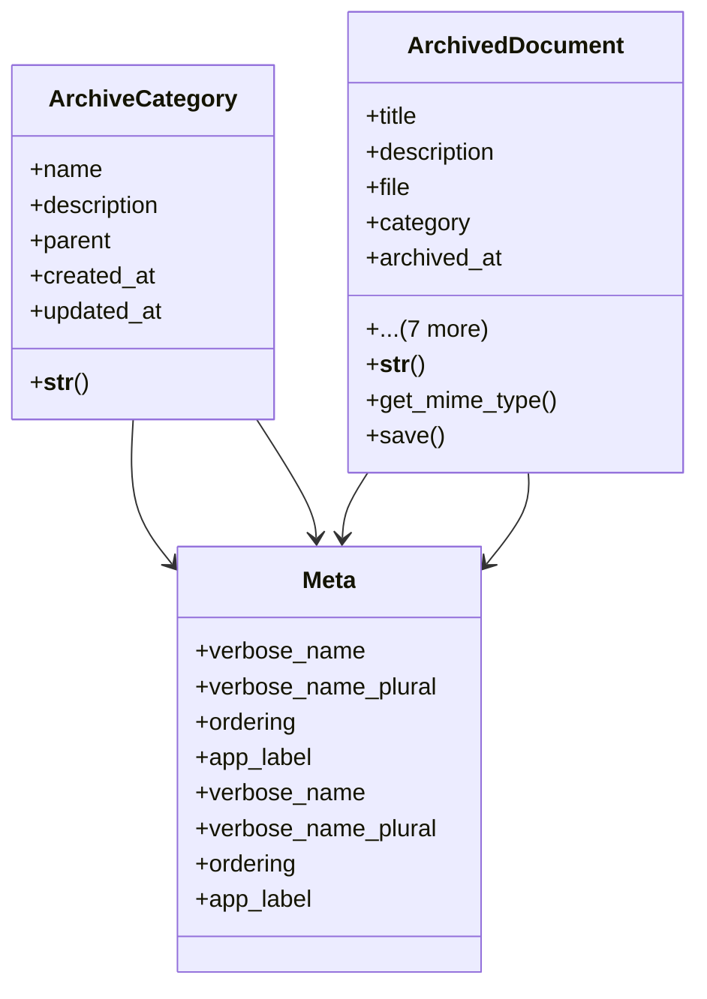

# core_modules.models

## Imports
- django.conf
- django.contrib.contenttypes.fields
- django.contrib.contenttypes.models
- django.db
- django.utils.translation
- magic

## Classes
- ArchiveCategory
  - attr: `name`
  - attr: `description`
  - attr: `parent`
  - attr: `created_at`
  - attr: `updated_at`
  - method: `__str__`
- ArchivedDocument
  - attr: `title`
  - attr: `description`
  - attr: `file`
  - attr: `category`
  - attr: `archived_at`
  - attr: `archived_by`
  - attr: `content_type`
  - attr: `object_id`
  - attr: `content_object`
  - attr: `original_filename`
  - attr: `file_size`
  - attr: `mime_type`
  - method: `__str__`
  - method: `get_mime_type`
  - method: `save`
- Meta
  - attr: `verbose_name`
  - attr: `verbose_name_plural`
  - attr: `ordering`
  - attr: `app_label`
- Meta
  - attr: `verbose_name`
  - attr: `verbose_name_plural`
  - attr: `ordering`
  - attr: `app_label`

## Functions
- __str__
- __str__
- get_mime_type
- save

## Class Diagram

