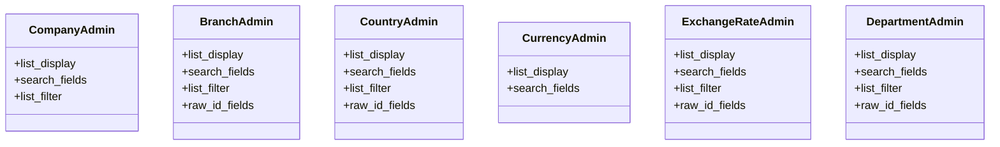

# core_modules.organization.admin

## Imports
- django.contrib
- models

## Classes
- CompanyAdmin
  - attr: `list_display`
  - attr: `search_fields`
  - attr: `list_filter`
- BranchAdmin
  - attr: `list_display`
  - attr: `search_fields`
  - attr: `list_filter`
  - attr: `raw_id_fields`
- CountryAdmin
  - attr: `list_display`
  - attr: `search_fields`
  - attr: `list_filter`
  - attr: `raw_id_fields`
- CurrencyAdmin
  - attr: `list_display`
  - attr: `search_fields`
- ExchangeRateAdmin
  - attr: `list_display`
  - attr: `search_fields`
  - attr: `list_filter`
  - attr: `raw_id_fields`
- DepartmentAdmin
  - attr: `list_display`
  - attr: `search_fields`
  - attr: `list_filter`
  - attr: `raw_id_fields`

## Class Diagram

