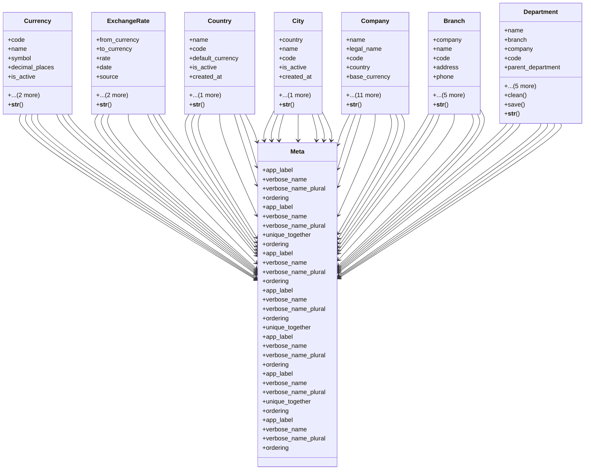

# core_modules.organization.models

## Imports
- decimal
- django.conf
- django.contrib.contenttypes.models
- django.core.exceptions
- django.core.validators
- django.db
- django.utils.translation

## Classes
- Currency
  - attr: `code`
  - attr: `name`
  - attr: `symbol`
  - attr: `decimal_places`
  - attr: `is_active`
  - attr: `created_at`
  - attr: `updated_at`
  - method: `__str__`
- ExchangeRate
  - attr: `from_currency`
  - attr: `to_currency`
  - attr: `rate`
  - attr: `date`
  - attr: `source`
  - attr: `created_at`
  - attr: `updated_at`
  - method: `__str__`
- Country
  - attr: `name`
  - attr: `code`
  - attr: `default_currency`
  - attr: `is_active`
  - attr: `created_at`
  - attr: `updated_at`
  - method: `__str__`
- City
  - attr: `country`
  - attr: `name`
  - attr: `code`
  - attr: `is_active`
  - attr: `created_at`
  - attr: `updated_at`
  - method: `__str__`
- Company
  - attr: `name`
  - attr: `legal_name`
  - attr: `code`
  - attr: `country`
  - attr: `base_currency`
  - attr: `registration_number`
  - attr: `tax_id`
  - attr: `address`
  - attr: `phone`
  - attr: `email`
  - attr: `website`
  - attr: `logo`
  - attr: `parent_company`
  - attr: `is_active`
  - attr: `created_at`
  - attr: `updated_at`
  - method: `__str__`
- Branch
  - attr: `company`
  - attr: `name`
  - attr: `code`
  - attr: `address`
  - attr: `phone`
  - attr: `email`
  - attr: `manager`
  - attr: `is_active`
  - attr: `created_at`
  - attr: `updated_at`
  - method: `__str__`
- Department
  - attr: `name`
  - attr: `branch`
  - attr: `company`
  - attr: `code`
  - attr: `parent_department`
  - attr: `manager`
  - attr: `description`
  - attr: `is_active`
  - attr: `created_at`
  - attr: `updated_at`
  - method: `clean`
  - method: `save`
  - method: `__str__`
- Meta
  - attr: `app_label`
  - attr: `verbose_name`
  - attr: `verbose_name_plural`
  - attr: `ordering`
- Meta
  - attr: `app_label`
  - attr: `verbose_name`
  - attr: `verbose_name_plural`
  - attr: `unique_together`
  - attr: `ordering`
- Meta
  - attr: `app_label`
  - attr: `verbose_name`
  - attr: `verbose_name_plural`
  - attr: `ordering`
- Meta
  - attr: `app_label`
  - attr: `verbose_name`
  - attr: `verbose_name_plural`
  - attr: `ordering`
  - attr: `unique_together`
- Meta
  - attr: `app_label`
  - attr: `verbose_name`
  - attr: `verbose_name_plural`
  - attr: `ordering`
- Meta
  - attr: `app_label`
  - attr: `verbose_name`
  - attr: `verbose_name_plural`
  - attr: `unique_together`
  - attr: `ordering`
- Meta
  - attr: `app_label`
  - attr: `verbose_name`
  - attr: `verbose_name_plural`
  - attr: `ordering`

## Functions
- __str__
- __str__
- __str__
- __str__
- __str__
- __str__
- clean
- save
- __str__

## Class Diagram

