# core_modules.organization.serializers

## Imports
- models
- rest_framework

## Classes
- CurrencySerializer
- ExchangeRateSerializer
  - attr: `from_currency_name`
  - attr: `to_currency_name`
- CountrySerializer
  - attr: `default_currency_name`
- CompanySerializer
  - attr: `country_name`
  - attr: `base_currency_name`
  - attr: `parent_company_name`
  - attr: `branches_count`
  - attr: `departments_count`
  - method: `get_branches_count`
  - method: `get_departments_count`
- BranchSerializer
  - attr: `company_name`
  - attr: `manager_name`
  - attr: `departments_count`
  - method: `get_departments_count`
- DepartmentSerializer
  - attr: `company_name`
  - attr: `branch_name`
  - attr: `parent_department_name`
  - attr: `manager_name`
  - attr: `sub_departments_count`
  - method: `get_sub_departments_count`
- CompanyListSerializer
  - attr: `country_name`
  - attr: `branches_count`
  - method: `get_branches_count`
- BranchListSerializer
  - attr: `company_name`
- DepartmentListSerializer
  - attr: `company_name`
  - attr: `branch_name`
- Meta
  - attr: `model`
  - attr: `fields`
- Meta
  - attr: `model`
  - attr: `fields`
- Meta
  - attr: `model`
  - attr: `fields`
- Meta
  - attr: `model`
  - attr: `fields`
- Meta
  - attr: `model`
  - attr: `fields`
- Meta
  - attr: `model`
  - attr: `fields`
- Meta
  - attr: `model`
  - attr: `fields`
- Meta
  - attr: `model`
  - attr: `fields`
- Meta
  - attr: `model`
  - attr: `fields`

## Functions
- get_branches_count
- get_departments_count
- get_departments_count
- get_sub_departments_count
- get_branches_count

## Class Diagram

```mermaid
classDiagram
    class CurrencySerializer {
    }
    class ExchangeRateSerializer {
        +from_currency_name
        +to_currency_name
    }
    class CountrySerializer {
        +default_currency_name
    }
    class CompanySerializer {
        +country_name
        +base_currency_name
        +parent_company_name
        +branches_count
        +departments_count
        +get_branches_count()
        +get_departments_count()
    }
    class BranchSerializer {
        +company_name
        +manager_name
        +departments_count
        +get_departments_count()
    }
    class DepartmentSerializer {
        +company_name
        +branch_name
        +parent_department_name
        +manager_name
        +sub_departments_count
        +get_sub_departments_count()
    }
    class CompanyListSerializer {
        +country_name
        +branches_count
        +get_branches_count()
    }
    class BranchListSerializer {
        +company_name
    }
    class DepartmentListSerializer {
        +company_name
        +branch_name
    }
    class Meta {
        +model
        +fields
    }
    class Meta {
        +model
        +fields
    }
    class Meta {
        +model
        +fields
    }
    class Meta {
        +model
        +fields
    }
    class Meta {
        +model
        +fields
    }
    class Meta {
        +model
        +fields
    }
    class Meta {
        +model
        +fields
    }
    class Meta {
        +model
        +fields
    }
    class Meta {
        +model
        +fields
    }
    CurrencySerializer --> Meta
    CurrencySerializer --> Meta
    CurrencySerializer --> Meta
    CurrencySerializer --> Meta
    CurrencySerializer --> Meta
    CurrencySerializer --> Meta
    CurrencySerializer --> Meta
    CurrencySerializer --> Meta
    CurrencySerializer --> Meta
    ExchangeRateSerializer --> Meta
    ExchangeRateSerializer --> Meta
    ExchangeRateSerializer --> Meta
    ExchangeRateSerializer --> Meta
    ExchangeRateSerializer --> Meta
    ExchangeRateSerializer --> Meta
    ExchangeRateSerializer --> Meta
    ExchangeRateSerializer --> Meta
    ExchangeRateSerializer --> Meta
    CountrySerializer --> Meta
    CountrySerializer --> Meta
    CountrySerializer --> Meta
    CountrySerializer --> Meta
    CountrySerializer --> Meta
    CountrySerializer --> Meta
    CountrySerializer --> Meta
    CountrySerializer --> Meta
    CountrySerializer --> Meta
    CompanySerializer --> Meta
    CompanySerializer --> Meta
    CompanySerializer --> Meta
    CompanySerializer --> Meta
    CompanySerializer --> Meta
    CompanySerializer --> Meta
    CompanySerializer --> Meta
    CompanySerializer --> Meta
    CompanySerializer --> Meta
    BranchSerializer --> Meta
    BranchSerializer --> Meta
    BranchSerializer --> Meta
    BranchSerializer --> Meta
    BranchSerializer --> Meta
    BranchSerializer --> Meta
    BranchSerializer --> Meta
    BranchSerializer --> Meta
    BranchSerializer --> Meta
    DepartmentSerializer --> Meta
    DepartmentSerializer --> Meta
    DepartmentSerializer --> Meta
    DepartmentSerializer --> Meta
    DepartmentSerializer --> Meta
    DepartmentSerializer --> Meta
    DepartmentSerializer --> Meta
    DepartmentSerializer --> Meta
    DepartmentSerializer --> Meta
    CompanyListSerializer --> Meta
    CompanyListSerializer --> Meta
    CompanyListSerializer --> Meta
    CompanyListSerializer --> Meta
    CompanyListSerializer --> Meta
    CompanyListSerializer --> Meta
    CompanyListSerializer --> Meta
    CompanyListSerializer --> Meta
    CompanyListSerializer --> Meta
    BranchListSerializer --> Meta
    BranchListSerializer --> Meta
    BranchListSerializer --> Meta
    BranchListSerializer --> Meta
    BranchListSerializer --> Meta
    BranchListSerializer --> Meta
    BranchListSerializer --> Meta
    BranchListSerializer --> Meta
    BranchListSerializer --> Meta
    DepartmentListSerializer --> Meta
    DepartmentListSerializer --> Meta
    DepartmentListSerializer --> Meta
    DepartmentListSerializer --> Meta
    DepartmentListSerializer --> Meta
    DepartmentListSerializer --> Meta
    DepartmentListSerializer --> Meta
    DepartmentListSerializer --> Meta
    DepartmentListSerializer --> Meta
```

