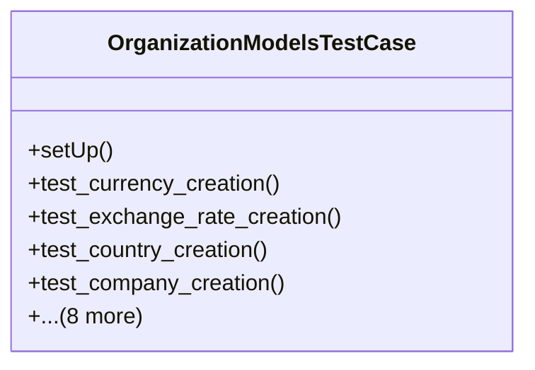

# core_modules.organization.tests.test_models

## Imports
- core_modules.core.models.branch
- core_modules.core.models.company
- core_modules.core.models.country
- core_modules.core.models.department
- core_modules.organization.models
- decimal
- django.contrib.auth
- django.core.exceptions
- django.test
- django.utils

## Classes
- OrganizationModelsTestCase
  - method: `setUp`
  - method: `test_currency_creation`
  - method: `test_exchange_rate_creation`
  - method: `test_country_creation`
  - method: `test_company_creation`
  - method: `test_branch_creation`
  - method: `test_department_creation_under_branch`
  - method: `test_department_creation_under_company`
  - method: `test_department_clean_method_no_branch_no_company`
  - method: `test_department_clean_method_branch_company_mismatch`
  - method: `test_company_unique_name`
  - method: `test_branch_unique_code_within_company`
  - method: `test_department_parent_child`

## Functions
- setUp
- test_currency_creation
- test_exchange_rate_creation
- test_country_creation
- test_company_creation
- test_branch_creation
- test_department_creation_under_branch
- test_department_creation_under_company
- test_department_clean_method_no_branch_no_company
- test_department_clean_method_branch_company_mismatch
- test_company_unique_name
- test_branch_unique_code_within_company
- test_department_parent_child

## Module Variables
- `User`

## Class Diagram

