# core_modules.permissions.admin

## Imports
- django.contrib
- django.utils.html
- django.utils.translation
- unified_permissions_model

## Classes
- PermissionAdmin
  - attr: `list_display`
  - attr: `list_filter`
  - attr: `search_fields`
  - attr: `ordering`
  - attr: `fieldsets`
- RoleAdmin
  - attr: `list_display`
  - attr: `list_filter`
  - attr: `search_fields`
  - attr: `ordering`
  - attr: `fieldsets`
- GroupAdmin
  - attr: `list_display`
  - attr: `list_filter`
  - attr: `search_fields`
  - attr: `ordering`
  - attr: `fieldsets`
- UserRoleAdmin
  - attr: `list_display`
  - attr: `list_filter`
  - attr: `search_fields`
  - attr: `ordering`
  - attr: `fieldsets`
  - method: `get_scope`
- UserGroupAdmin
  - attr: `list_display`
  - attr: `list_filter`
  - attr: `search_fields`
  - attr: `ordering`
  - attr: `fieldsets`
- UserPermissionAdmin
  - attr: `list_display`
  - attr: `list_filter`
  - attr: `search_fields`
  - attr: `ordering`
  - attr: `fieldsets`
  - method: `get_scope`
- ResourcePermissionAdmin
  - attr: `list_display`
  - attr: `list_filter`
  - attr: `search_fields`
  - attr: `ordering`
  - attr: `fieldsets`
  - method: `get_resource`
  - method: `get_scope`
- PermissionRequestAdmin
  - attr: `list_display`
  - attr: `list_filter`
  - attr: `search_fields`
  - attr: `ordering`
  - attr: `readonly_fields`
  - attr: `fieldsets`
  - method: `get_request_type`
- TemporaryPermissionAdmin
  - attr: `list_display`
  - attr: `list_filter`
  - attr: `search_fields`
  - attr: `ordering`
  - attr: `fieldsets`
  - method: `get_permission_type`
- PermissionLogAdmin
  - attr: `list_display`
  - attr: `list_filter`
  - attr: `search_fields`
  - attr: `ordering`
  - attr: `readonly_fields`
  - attr: `fieldsets`
  - method: `get_target`

## Functions
- get_scope
- get_scope
- get_resource
- get_scope
- get_request_type
- get_permission_type
- get_target

## Class Diagram

```mermaid
classDiagram
    class PermissionAdmin {
        +list_display
        +list_filter
        +search_fields
        +ordering
        +fieldsets
    }
    class RoleAdmin {
        +list_display
        +list_filter
        +search_fields
        +ordering
        +fieldsets
    }
    class GroupAdmin {
        +list_display
        +list_filter
        +search_fields
        +ordering
        +fieldsets
    }
    class UserRoleAdmin {
        +list_display
        +list_filter
        +search_fields
        +ordering
        +fieldsets
        +get_scope()
    }
    class UserGroupAdmin {
        +list_display
        +list_filter
        +search_fields
        +ordering
        +fieldsets
    }
    class UserPermissionAdmin {
        +list_display
        +list_filter
        +search_fields
        +ordering
        +fieldsets
        +get_scope()
    }
    class ResourcePermissionAdmin {
        +list_display
        +list_filter
        +search_fields
        +ordering
        +fieldsets
        +get_resource()
        +get_scope()
    }
    class PermissionRequestAdmin {
        +list_display
        +list_filter
        +search_fields
        +ordering
        +readonly_fields
        +... (1 more)
        +get_request_type()
    }
    class TemporaryPermissionAdmin {
        +list_display
        +list_filter
        +search_fields
        +ordering
        +fieldsets
        +get_permission_type()
    }
    class PermissionLogAdmin {
        +list_display
        +list_filter
        +search_fields
        +ordering
        +readonly_fields
        +... (1 more)
        +get_target()
    }
```

