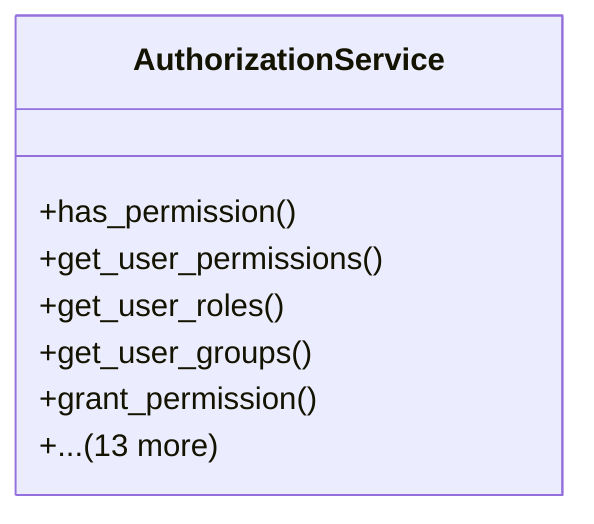

# core_modules.permissions.authorization_service

## Imports
- django.contrib.auth
- django.contrib.contenttypes.models
- django.db.models
- django.utils
- json
- logging
- unified_permissions_model

## Classes
- AuthorizationService
  - method: `has_permission`
  - method: `get_user_permissions`
  - method: `get_user_roles`
  - method: `get_user_groups`
  - method: `grant_permission`
  - method: `revoke_permission`
  - method: `assign_role`
  - method: `remove_role`
  - method: `add_to_group`
  - method: `remove_from_group`
  - method: `grant_resource_permission`
  - method: `revoke_resource_permission`
  - method: `request_permission`
  - method: `approve_permission_request`
  - method: `reject_permission_request`
  - method: `grant_temporary_permission`
  - method: `revoke_temporary_permission`
  - method: `_check_scope_match`

## Functions
- has_permission
- get_user_permissions
- get_user_roles
- get_user_groups
- grant_permission
- revoke_permission
- assign_role
- remove_role
- add_to_group
- remove_from_group
- grant_resource_permission
- revoke_resource_permission
- request_permission
- approve_permission_request
- reject_permission_request
- grant_temporary_permission
- revoke_temporary_permission
- _check_scope_match

## Module Variables
- `User`
- `logger`

## Class Diagram

