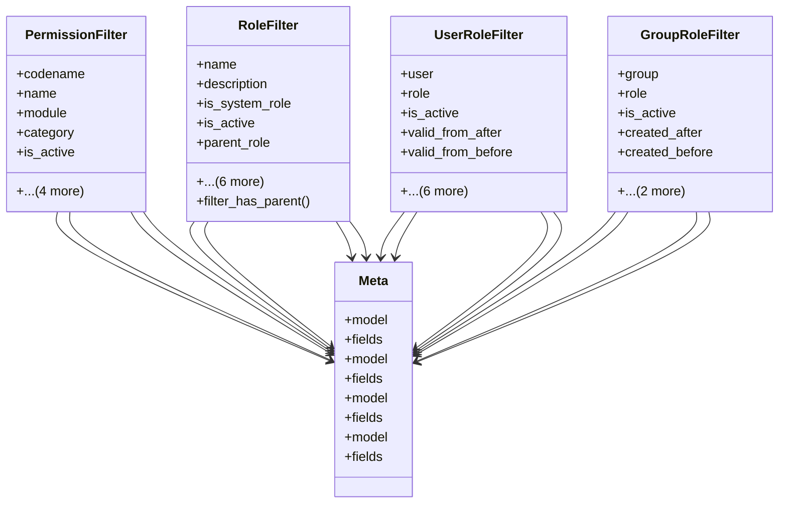

# core_modules.permissions.filters

## Imports
- django.db.models
- django.utils.translation
- django_filters
- unified_permissions_model

## Classes
- PermissionFilter
  - attr: `codename`
  - attr: `name`
  - attr: `module`
  - attr: `category`
  - attr: `is_active`
  - attr: `created_after`
  - attr: `created_before`
  - attr: `updated_after`
  - attr: `updated_before`
- RoleFilter
  - attr: `name`
  - attr: `description`
  - attr: `is_system_role`
  - attr: `is_active`
  - attr: `parent_role`
  - attr: `has_parent`
  - attr: `permission`
  - attr: `created_after`
  - attr: `created_before`
  - attr: `updated_after`
  - attr: `updated_before`
  - method: `filter_has_parent`
- UserRoleFilter
  - attr: `user`
  - attr: `role`
  - attr: `is_active`
  - attr: `valid_from_after`
  - attr: `valid_from_before`
  - attr: `valid_to_after`
  - attr: `valid_to_before`
  - attr: `created_after`
  - attr: `created_before`
  - attr: `updated_after`
  - attr: `updated_before`
- GroupRoleFilter
  - attr: `group`
  - attr: `role`
  - attr: `is_active`
  - attr: `created_after`
  - attr: `created_before`
  - attr: `updated_after`
  - attr: `updated_before`
- Meta
  - attr: `model`
  - attr: `fields`
- Meta
  - attr: `model`
  - attr: `fields`
- Meta
  - attr: `model`
  - attr: `fields`
- Meta
  - attr: `model`
  - attr: `fields`

## Functions
- filter_has_parent

## Class Diagram

