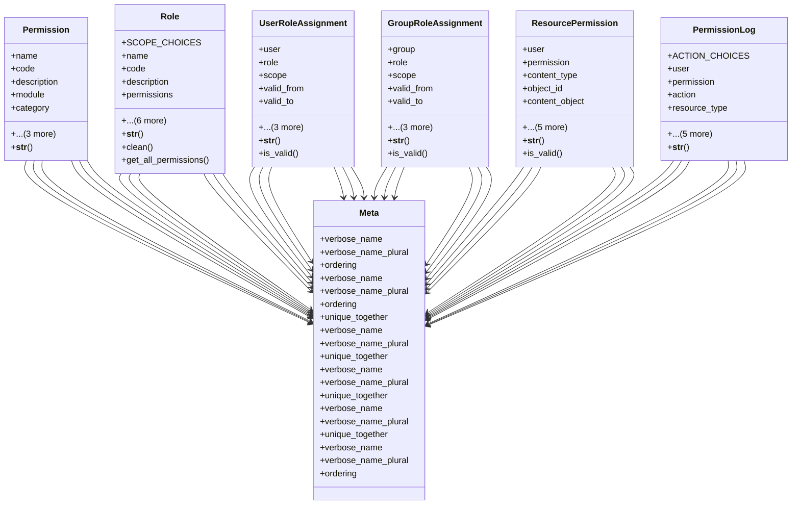

# core_modules.permissions.models_fixed

## Imports
- django.contrib.auth
- django.contrib.contenttypes.fields
- django.contrib.contenttypes.models
- django.core.exceptions
- django.db
- django.utils
- django.utils.translation
- json

## Classes
- Permission
  - attr: `name`
  - attr: `code`
  - attr: `description`
  - attr: `module`
  - attr: `category`
  - attr: `is_active`
  - attr: `created_at`
  - attr: `updated_at`
  - method: `__str__`
- Role
  - attr: `SCOPE_CHOICES`
  - attr: `name`
  - attr: `code`
  - attr: `description`
  - attr: `permissions`
  - attr: `parent_role`
  - attr: `scope_type`
  - attr: `is_system_role`
  - attr: `is_active`
  - attr: `created_at`
  - attr: `updated_at`
  - method: `__str__`
  - method: `clean`
  - method: `get_all_permissions`
- UserRoleAssignment
  - attr: `user`
  - attr: `role`
  - attr: `scope`
  - attr: `valid_from`
  - attr: `valid_to`
  - attr: `is_active`
  - attr: `created_at`
  - attr: `updated_at`
  - method: `__str__`
  - method: `is_valid`
- GroupRoleAssignment
  - attr: `group`
  - attr: `role`
  - attr: `scope`
  - attr: `valid_from`
  - attr: `valid_to`
  - attr: `is_active`
  - attr: `created_at`
  - attr: `updated_at`
  - method: `__str__`
  - method: `is_valid`
- ResourcePermission
  - attr: `user`
  - attr: `permission`
  - attr: `content_type`
  - attr: `object_id`
  - attr: `content_object`
  - attr: `scope`
  - attr: `granted_by`
  - attr: `granted_at`
  - attr: `expires_at`
  - attr: `is_active`
  - method: `__str__`
  - method: `is_valid`
- PermissionLog
  - attr: `ACTION_CHOICES`
  - attr: `user`
  - attr: `permission`
  - attr: `action`
  - attr: `resource_type`
  - attr: `resource_id`
  - attr: `ip_address`
  - attr: `user_agent`
  - attr: `details`
  - attr: `timestamp`
  - method: `__str__`
- Meta
  - attr: `verbose_name`
  - attr: `verbose_name_plural`
  - attr: `ordering`
- Meta
  - attr: `verbose_name`
  - attr: `verbose_name_plural`
  - attr: `ordering`
  - attr: `unique_together`
- Meta
  - attr: `verbose_name`
  - attr: `verbose_name_plural`
  - attr: `unique_together`
- Meta
  - attr: `verbose_name`
  - attr: `verbose_name_plural`
  - attr: `unique_together`
- Meta
  - attr: `verbose_name`
  - attr: `verbose_name_plural`
  - attr: `unique_together`
- Meta
  - attr: `verbose_name`
  - attr: `verbose_name_plural`
  - attr: `ordering`

## Functions
- __str__
- __str__
- clean
- get_all_permissions
- __str__
- is_valid
- __str__
- is_valid
- __str__
- is_valid
- __str__

## Module Variables
- `User`

## Class Diagram

