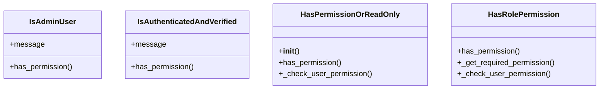

# core_modules.permissions.permissions

## Imports
- django.db.models
- django.utils
- django.utils.translation
- rest_framework
- unified_permissions_model

## Classes
- IsAdminUser
  - attr: `message`
  - method: `has_permission`
- IsAuthenticatedAndVerified
  - attr: `message`
  - method: `has_permission`
- HasPermissionOrReadOnly
  - method: `__init__`
  - method: `has_permission`
  - method: `_check_user_permission`
- HasRolePermission
  - method: `has_permission`
  - method: `_get_required_permission`
  - method: `_check_user_permission`

## Functions
- has_permission
- has_permission
- __init__
- has_permission
- _check_user_permission
- has_permission
- _get_required_permission
- _check_user_permission

## Class Diagram

