# core_modules.permissions.serializers

## Imports
- django.contrib.auth
- django.contrib.contenttypes.models
- rest_framework
- unified_permissions_model

## Classes
- PermissionSerializer
- RoleSerializer
  - attr: `permissions`
- RolePermissionSerializer
  - attr: `role`
  - attr: `permission`
  - attr: `role_id`
  - attr: `permission_id`
- GroupSerializer
  - attr: `roles`
- GroupRoleSerializer
  - attr: `group`
  - attr: `role`
  - attr: `group_id`
  - attr: `role_id`
- UserRoleSerializer
  - attr: `user`
  - attr: `role`
  - attr: `role_id`
- UserGroupSerializer
  - attr: `user`
  - attr: `group`
  - attr: `group_id`
- UserPermissionSerializer
  - attr: `user`
  - attr: `permission`
  - attr: `permission_id`
- ResourcePermissionSerializer
  - attr: `permission`
  - attr: `permission_id`
  - attr: `content_type`
  - attr: `user`
  - attr: `group`
  - attr: `role`
  - method: `validate`
- PermissionRequestSerializer
  - attr: `user`
  - attr: `permission`
  - attr: `permission_id`
  - attr: `role`
  - attr: `role_id`
  - attr: `group`
  - attr: `group_id`
  - attr: `content_type`
  - method: `validate`
- PermissionLogSerializer
  - attr: `user`
  - attr: `action_user`
  - attr: `permission`
  - attr: `role`
  - attr: `group`
- TemporaryPermissionSerializer
  - attr: `user`
  - attr: `permission`
  - attr: `permission_id`
  - attr: `role`
  - attr: `role_id`
  - attr: `group`
  - attr: `group_id`
  - attr: `granted_by`
  - method: `validate`
- CheckPermissionSerializer
  - attr: `user_id`
  - attr: `permission_code`
  - attr: `resource_type`
  - attr: `resource_id`
  - attr: `scope`
  - method: `validate`
- GrantPermissionSerializer
  - attr: `user_id`
  - attr: `permission_code`
  - attr: `scope`
  - attr: `valid_from`
  - attr: `valid_to`
  - method: `validate`
- RevokePermissionSerializer
  - attr: `user_id`
  - attr: `permission_code`
  - method: `validate`
- AssignRoleSerializer
  - attr: `user_id`
  - attr: `role_code`
  - attr: `scope`
  - attr: `valid_from`
  - attr: `valid_to`
  - method: `validate`
- RemoveRoleSerializer
  - attr: `user_id`
  - attr: `role_code`
  - method: `validate`
- AddToGroupSerializer
  - attr: `user_id`
  - attr: `group_name`
  - attr: `valid_from`
  - attr: `valid_to`
  - method: `validate`
- RemoveFromGroupSerializer
  - attr: `user_id`
  - attr: `group_name`
  - method: `validate`
- Meta
  - attr: `model`
  - attr: `fields`
  - attr: `read_only_fields`
- Meta
  - attr: `model`
  - attr: `fields`
  - attr: `read_only_fields`
- Meta
  - attr: `model`
  - attr: `fields`
  - attr: `read_only_fields`
- Meta
  - attr: `model`
  - attr: `fields`
  - attr: `read_only_fields`
- Meta
  - attr: `model`
  - attr: `fields`
  - attr: `read_only_fields`
- Meta
  - attr: `model`
  - attr: `fields`
  - attr: `read_only_fields`
- Meta
  - attr: `model`
  - attr: `fields`
  - attr: `read_only_fields`
- Meta
  - attr: `model`
  - attr: `fields`
  - attr: `read_only_fields`
- Meta
  - attr: `model`
  - attr: `fields`
  - attr: `read_only_fields`
- Meta
  - attr: `model`
  - attr: `fields`
  - attr: `read_only_fields`
- Meta
  - attr: `model`
  - attr: `fields`
  - attr: `read_only_fields`
- Meta
  - attr: `model`
  - attr: `fields`
  - attr: `read_only_fields`

## Functions
- validate
- validate
- validate
- validate
- validate
- validate
- validate
- validate
- validate
- validate

## Module Variables
- `User`

## Class Diagram

```mermaid
classDiagram
    class PermissionSerializer {
    }
    class RoleSerializer {
        +permissions
    }
    class RolePermissionSerializer {
        +role
        +permission
        +role_id
        +permission_id
    }
    class GroupSerializer {
        +roles
    }
    class GroupRoleSerializer {
        +group
        +role
        +group_id
        +role_id
    }
    class UserRoleSerializer {
        +user
        +role
        +role_id
    }
    class UserGroupSerializer {
        +user
        +group
        +group_id
    }
    class UserPermissionSerializer {
        +user
        +permission
        +permission_id
    }
    class ResourcePermissionSerializer {
        +permission
        +permission_id
        +content_type
        +user
        +group
        +... (1 more)
        +validate()
    }
    class PermissionRequestSerializer {
        +user
        +permission
        +permission_id
        +role
        +role_id
        +... (3 more)
        +validate()
    }
    class PermissionLogSerializer {
        +user
        +action_user
        +permission
        +role
        +group
    }
    class TemporaryPermissionSerializer {
        +user
        +permission
        +permission_id
        +role
        +role_id
        +... (3 more)
        +validate()
    }
    class CheckPermissionSerializer {
        +user_id
        +permission_code
        +resource_type
        +resource_id
        +scope
        +validate()
    }
    class GrantPermissionSerializer {
        +user_id
        +permission_code
        +scope
        +valid_from
        +valid_to
        +validate()
    }
    class RevokePermissionSerializer {
        +user_id
        +permission_code
        +validate()
    }
    class AssignRoleSerializer {
        +user_id
        +role_code
        +scope
        +valid_from
        +valid_to
        +validate()
    }
    class RemoveRoleSerializer {
        +user_id
        +role_code
        +validate()
    }
    class AddToGroupSerializer {
        +user_id
        +group_name
        +valid_from
        +valid_to
        +validate()
    }
    class RemoveFromGroupSerializer {
        +user_id
        +group_name
        +validate()
    }
    class Meta {
        +model
        +fields
        +read_only_fields
    }
    class Meta {
        +model
        +fields
        +read_only_fields
    }
    class Meta {
        +model
        +fields
        +read_only_fields
    }
    class Meta {
        +model
        +fields
        +read_only_fields
    }
    class Meta {
        +model
        +fields
        +read_only_fields
    }
    class Meta {
        +model
        +fields
        +read_only_fields
    }
    class Meta {
        +model
        +fields
        +read_only_fields
    }
    class Meta {
        +model
        +fields
        +read_only_fields
    }
    class Meta {
        +model
        +fields
        +read_only_fields
    }
    class Meta {
        +model
        +fields
        +read_only_fields
    }
    class Meta {
        +model
        +fields
        +read_only_fields
    }
    class Meta {
        +model
        +fields
        +read_only_fields
    }
    PermissionSerializer --> Meta
    PermissionSerializer --> Meta
    PermissionSerializer --> Meta
    PermissionSerializer --> Meta
    PermissionSerializer --> Meta
    PermissionSerializer --> Meta
    PermissionSerializer --> Meta
    PermissionSerializer --> Meta
    PermissionSerializer --> Meta
    PermissionSerializer --> Meta
    PermissionSerializer --> Meta
    PermissionSerializer --> Meta
    RoleSerializer --> Meta
    RoleSerializer --> Meta
    RoleSerializer --> Meta
    RoleSerializer --> Meta
    RoleSerializer --> Meta
    RoleSerializer --> Meta
    RoleSerializer --> Meta
    RoleSerializer --> Meta
    RoleSerializer --> Meta
    RoleSerializer --> Meta
    RoleSerializer --> Meta
    RoleSerializer --> Meta
    RolePermissionSerializer --> Meta
    RolePermissionSerializer --> Meta
    RolePermissionSerializer --> Meta
    RolePermissionSerializer --> Meta
    RolePermissionSerializer --> Meta
    RolePermissionSerializer --> Meta
    RolePermissionSerializer --> Meta
    RolePermissionSerializer --> Meta
    RolePermissionSerializer --> Meta
    RolePermissionSerializer --> Meta
    RolePermissionSerializer --> Meta
    RolePermissionSerializer --> Meta
    GroupSerializer --> Meta
    GroupSerializer --> Meta
    GroupSerializer --> Meta
    GroupSerializer --> Meta
    GroupSerializer --> Meta
    GroupSerializer --> Meta
    GroupSerializer --> Meta
    GroupSerializer --> Meta
    GroupSerializer --> Meta
    GroupSerializer --> Meta
    GroupSerializer --> Meta
    GroupSerializer --> Meta
    GroupRoleSerializer --> Meta
    GroupRoleSerializer --> Meta
    GroupRoleSerializer --> Meta
    GroupRoleSerializer --> Meta
    GroupRoleSerializer --> Meta
    GroupRoleSerializer --> Meta
    GroupRoleSerializer --> Meta
    GroupRoleSerializer --> Meta
    GroupRoleSerializer --> Meta
    GroupRoleSerializer --> Meta
    GroupRoleSerializer --> Meta
    GroupRoleSerializer --> Meta
    UserRoleSerializer --> Meta
    UserRoleSerializer --> Meta
    UserRoleSerializer --> Meta
    UserRoleSerializer --> Meta
    UserRoleSerializer --> Meta
    UserRoleSerializer --> Meta
    UserRoleSerializer --> Meta
    UserRoleSerializer --> Meta
    UserRoleSerializer --> Meta
    UserRoleSerializer --> Meta
    UserRoleSerializer --> Meta
    UserRoleSerializer --> Meta
    UserGroupSerializer --> Meta
    UserGroupSerializer --> Meta
    UserGroupSerializer --> Meta
    UserGroupSerializer --> Meta
    UserGroupSerializer --> Meta
    UserGroupSerializer --> Meta
    UserGroupSerializer --> Meta
    UserGroupSerializer --> Meta
    UserGroupSerializer --> Meta
    UserGroupSerializer --> Meta
    UserGroupSerializer --> Meta
    UserGroupSerializer --> Meta
    UserPermissionSerializer --> Meta
    UserPermissionSerializer --> Meta
    UserPermissionSerializer --> Meta
    UserPermissionSerializer --> Meta
    UserPermissionSerializer --> Meta
    UserPermissionSerializer --> Meta
    UserPermissionSerializer --> Meta
    UserPermissionSerializer --> Meta
    UserPermissionSerializer --> Meta
    UserPermissionSerializer --> Meta
    UserPermissionSerializer --> Meta
    UserPermissionSerializer --> Meta
    ResourcePermissionSerializer --> Meta
    ResourcePermissionSerializer --> Meta
    ResourcePermissionSerializer --> Meta
    ResourcePermissionSerializer --> Meta
    ResourcePermissionSerializer --> Meta
    ResourcePermissionSerializer --> Meta
    ResourcePermissionSerializer --> Meta
    ResourcePermissionSerializer --> Meta
    ResourcePermissionSerializer --> Meta
    ResourcePermissionSerializer --> Meta
    ResourcePermissionSerializer --> Meta
    ResourcePermissionSerializer --> Meta
    PermissionRequestSerializer --> Meta
    PermissionRequestSerializer --> Meta
    PermissionRequestSerializer --> Meta
    PermissionRequestSerializer --> Meta
    PermissionRequestSerializer --> Meta
    PermissionRequestSerializer --> Meta
    PermissionRequestSerializer --> Meta
    PermissionRequestSerializer --> Meta
    PermissionRequestSerializer --> Meta
    PermissionRequestSerializer --> Meta
    PermissionRequestSerializer --> Meta
    PermissionRequestSerializer --> Meta
    PermissionLogSerializer --> Meta
    PermissionLogSerializer --> Meta
    PermissionLogSerializer --> Meta
    PermissionLogSerializer --> Meta
    PermissionLogSerializer --> Meta
    PermissionLogSerializer --> Meta
    PermissionLogSerializer --> Meta
    PermissionLogSerializer --> Meta
    PermissionLogSerializer --> Meta
    PermissionLogSerializer --> Meta
    PermissionLogSerializer --> Meta
    PermissionLogSerializer --> Meta
    TemporaryPermissionSerializer --> Meta
    TemporaryPermissionSerializer --> Meta
    TemporaryPermissionSerializer --> Meta
    TemporaryPermissionSerializer --> Meta
    TemporaryPermissionSerializer --> Meta
    TemporaryPermissionSerializer --> Meta
    TemporaryPermissionSerializer --> Meta
    TemporaryPermissionSerializer --> Meta
    TemporaryPermissionSerializer --> Meta
    TemporaryPermissionSerializer --> Meta
    TemporaryPermissionSerializer --> Meta
    TemporaryPermissionSerializer --> Meta
    CheckPermissionSerializer --> Meta
    CheckPermissionSerializer --> Meta
    CheckPermissionSerializer --> Meta
    CheckPermissionSerializer --> Meta
    CheckPermissionSerializer --> Meta
    CheckPermissionSerializer --> Meta
    CheckPermissionSerializer --> Meta
    CheckPermissionSerializer --> Meta
    CheckPermissionSerializer --> Meta
    CheckPermissionSerializer --> Meta
    CheckPermissionSerializer --> Meta
    CheckPermissionSerializer --> Meta
    GrantPermissionSerializer --> Meta
    GrantPermissionSerializer --> Meta
    GrantPermissionSerializer --> Meta
    GrantPermissionSerializer --> Meta
    GrantPermissionSerializer --> Meta
    GrantPermissionSerializer --> Meta
    GrantPermissionSerializer --> Meta
    GrantPermissionSerializer --> Meta
    GrantPermissionSerializer --> Meta
    GrantPermissionSerializer --> Meta
    GrantPermissionSerializer --> Meta
    GrantPermissionSerializer --> Meta
    RevokePermissionSerializer --> Meta
    RevokePermissionSerializer --> Meta
    RevokePermissionSerializer --> Meta
    RevokePermissionSerializer --> Meta
    RevokePermissionSerializer --> Meta
    RevokePermissionSerializer --> Meta
    RevokePermissionSerializer --> Meta
    RevokePermissionSerializer --> Meta
    RevokePermissionSerializer --> Meta
    RevokePermissionSerializer --> Meta
    RevokePermissionSerializer --> Meta
    RevokePermissionSerializer --> Meta
    AssignRoleSerializer --> Meta
    AssignRoleSerializer --> Meta
    AssignRoleSerializer --> Meta
    AssignRoleSerializer --> Meta
    AssignRoleSerializer --> Meta
    AssignRoleSerializer --> Meta
    AssignRoleSerializer --> Meta
    AssignRoleSerializer --> Meta
    AssignRoleSerializer --> Meta
    AssignRoleSerializer --> Meta
    AssignRoleSerializer --> Meta
    AssignRoleSerializer --> Meta
    RemoveRoleSerializer --> Meta
    RemoveRoleSerializer --> Meta
    RemoveRoleSerializer --> Meta
    RemoveRoleSerializer --> Meta
    RemoveRoleSerializer --> Meta
    RemoveRoleSerializer --> Meta
    RemoveRoleSerializer --> Meta
    RemoveRoleSerializer --> Meta
    RemoveRoleSerializer --> Meta
    RemoveRoleSerializer --> Meta
    RemoveRoleSerializer --> Meta
    RemoveRoleSerializer --> Meta
    AddToGroupSerializer --> Meta
    AddToGroupSerializer --> Meta
    AddToGroupSerializer --> Meta
    AddToGroupSerializer --> Meta
    AddToGroupSerializer --> Meta
    AddToGroupSerializer --> Meta
    AddToGroupSerializer --> Meta
    AddToGroupSerializer --> Meta
    AddToGroupSerializer --> Meta
    AddToGroupSerializer --> Meta
    AddToGroupSerializer --> Meta
    AddToGroupSerializer --> Meta
    RemoveFromGroupSerializer --> Meta
    RemoveFromGroupSerializer --> Meta
    RemoveFromGroupSerializer --> Meta
    RemoveFromGroupSerializer --> Meta
    RemoveFromGroupSerializer --> Meta
    RemoveFromGroupSerializer --> Meta
    RemoveFromGroupSerializer --> Meta
    RemoveFromGroupSerializer --> Meta
    RemoveFromGroupSerializer --> Meta
    RemoveFromGroupSerializer --> Meta
    RemoveFromGroupSerializer --> Meta
    RemoveFromGroupSerializer --> Meta
```

