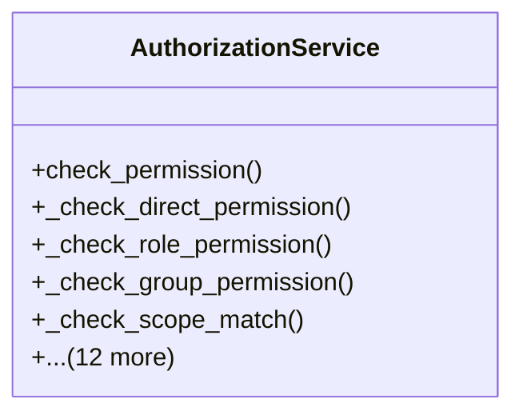

# core_modules.permissions.services

## Imports
- django.contrib.auth
- django.contrib.contenttypes.models
- django.db.models
- django.utils
- unified_permissions_model

## Classes
- AuthorizationService
  - method: `check_permission`
  - method: `_check_direct_permission`
  - method: `_check_role_permission`
  - method: `_check_group_permission`
  - method: `_check_scope_match`
  - method: `grant_permission`
  - method: `revoke_permission`
  - method: `assign_role`
  - method: `revoke_role`
  - method: `add_user_to_group`
  - method: `remove_user_from_group`
  - method: `request_permission`
  - method: `approve_permission_request`
  - method: `reject_permission_request`
  - method: `get_user_permissions`
  - method: `get_user_roles`
  - method: `get_user_groups`

## Functions
- check_permission
- _check_direct_permission
- _check_role_permission
- _check_group_permission
- _check_scope_match
- grant_permission
- revoke_permission
- assign_role
- revoke_role
- add_user_to_group
- remove_user_from_group
- request_permission
- approve_permission_request
- reject_permission_request
- get_user_permissions
- get_user_roles
- get_user_groups

## Module Variables
- `User`

## Class Diagram

