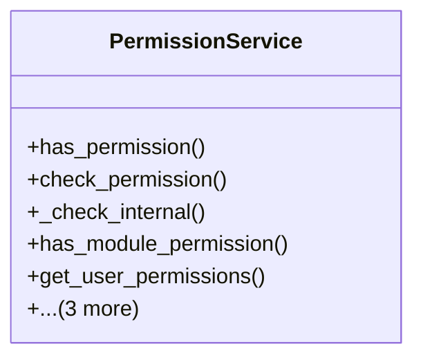

# core_modules.permissions.services.permission_service

## Imports
- django.contrib.auth
- django.contrib.contenttypes.models
- django.db.models
- typing

## Classes
- PermissionService
  - method: `has_permission`
  - method: `check_permission`
  - method: `_check_internal`
  - method: `has_module_permission`
  - method: `get_user_permissions`
  - method: `can_access_object`
  - method: `filter_queryset_by_permissions`
  - method: `log_permission_check`

## Functions
- has_permission
- check_permission
- _check_internal
- has_module_permission
- get_user_permissions
- can_access_object
- filter_queryset_by_permissions
- log_permission_check

## Module Variables
- `User`

## Class Diagram

