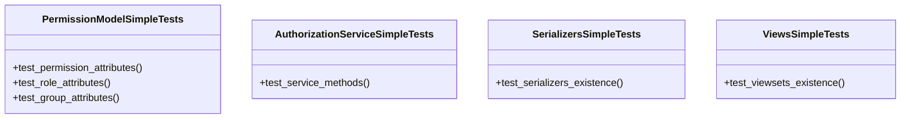

# core_modules.permissions.simplified_tests

## Imports
- core_modules.permissions.authorization_service
- core_modules.permissions.serializers
- core_modules.permissions.unified_permissions_model
- core_modules.permissions.viewsets
- json
- os
- rest_framework
- sys
- unittest

## Classes
- PermissionModelSimpleTests
  - method: `test_permission_attributes`
  - method: `test_role_attributes`
  - method: `test_group_attributes`
- AuthorizationServiceSimpleTests
  - method: `test_service_methods`
- SerializersSimpleTests
  - method: `test_serializers_existence`
- ViewsSimpleTests
  - method: `test_viewsets_existence`

## Functions
- test_permission_attributes
- test_role_attributes
- test_group_attributes
- test_service_methods
- test_serializers_existence
- test_viewsets_existence

## Class Diagram

