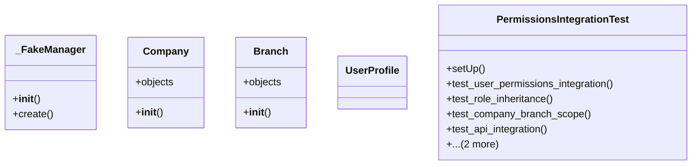

# core_modules.permissions.test_integration

## Imports
- django.contrib.auth.models
- django.test
- django.urls
- rest_framework
- rest_framework.response
- rest_framework.test
- typing
- unified_permissions_model

## Classes
- _FakeManager
  - method: `__init__`
  - method: `create`
- Company
  - attr: `objects`
  - method: `__init__`
- Branch
  - attr: `objects`
  - method: `__init__`
- UserProfile
- PermissionsIntegrationTest
  - method: `setUp`
  - method: `test_user_permissions_integration`
  - method: `test_role_inheritance`
  - method: `test_company_branch_scope`
  - method: `test_api_integration`
  - method: `test_user_role_assignment_api`
  - method: `has_permission`

## Functions
- __init__
- create
- __init__
- __init__
- setUp
- test_user_permissions_integration
- test_role_inheritance
- test_company_branch_scope
- test_api_integration
- test_user_role_assignment_api
- has_permission

## Class Diagram

