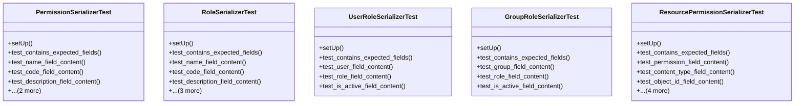

# core_modules.permissions.test_serializers

## Imports
- datetime
- django.contrib.auth
- django.contrib.auth.models
- django.contrib.contenttypes.models
- django.test
- django.utils
- json
- rest_framework.exceptions
- serializers
- unified_permissions_model

## Classes
- PermissionSerializerTest
  - method: `setUp`
  - method: `test_contains_expected_fields`
  - method: `test_name_field_content`
  - method: `test_code_field_content`
  - method: `test_description_field_content`
  - method: `test_category_field_content`
  - method: `test_is_active_field_content`
- RoleSerializerTest
  - method: `setUp`
  - method: `test_contains_expected_fields`
  - method: `test_name_field_content`
  - method: `test_code_field_content`
  - method: `test_description_field_content`
  - method: `test_is_system_role_field_content`
  - method: `test_is_active_field_content`
  - method: `test_permissions_field_content`
- UserRoleSerializerTest
  - method: `setUp`
  - method: `test_contains_expected_fields`
  - method: `test_user_field_content`
  - method: `test_role_field_content`
  - method: `test_is_active_field_content`
- GroupRoleSerializerTest
  - method: `setUp`
  - method: `test_contains_expected_fields`
  - method: `test_group_field_content`
  - method: `test_role_field_content`
  - method: `test_is_active_field_content`
- ResourcePermissionSerializerTest
  - method: `setUp`
  - method: `test_contains_expected_fields`
  - method: `test_permission_field_content`
  - method: `test_content_type_field_content`
  - method: `test_object_id_field_content`
  - method: `test_user_field_content`
  - method: `test_is_active_field_content`
  - method: `test_validation_one_target_required`
  - method: `test_validation_only_one_target_allowed`

## Functions
- setUp
- test_contains_expected_fields
- test_name_field_content
- test_code_field_content
- test_description_field_content
- test_category_field_content
- test_is_active_field_content
- setUp
- test_contains_expected_fields
- test_name_field_content
- test_code_field_content
- test_description_field_content
- test_is_system_role_field_content
- test_is_active_field_content
- test_permissions_field_content
- setUp
- test_contains_expected_fields
- test_user_field_content
- test_role_field_content
- test_is_active_field_content
- setUp
- test_contains_expected_fields
- test_group_field_content
- test_role_field_content
- test_is_active_field_content
- setUp
- test_contains_expected_fields
- test_permission_field_content
- test_content_type_field_content
- test_object_id_field_content
- test_user_field_content
- test_is_active_field_content
- test_validation_one_target_required
- test_validation_only_one_target_allowed

## Module Variables
- `User`

## Class Diagram

