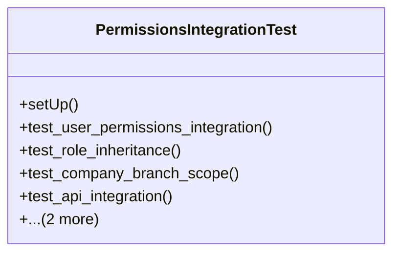

# core_modules.permissions.tests.test_integration

## Imports
- companies.models
- django.contrib.auth.models
- django.test
- django.urls
- rest_framework
- rest_framework.test
- unified_permissions_model

## Classes
- PermissionsIntegrationTest
  - method: `setUp`
  - method: `test_user_permissions_integration`
  - method: `test_role_inheritance`
  - method: `test_company_branch_scope`
  - method: `test_api_integration`
  - method: `test_user_role_assignment_api`
  - method: `has_permission`

## Functions
- setUp
- test_user_permissions_integration
- test_role_inheritance
- test_company_branch_scope
- test_api_integration
- test_user_role_assignment_api
- has_permission

## Class Diagram

