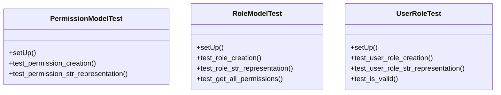

# core_modules.permissions.tests.test_models

## Imports
- core_modules.unified_permissions.models
- datetime
- django.contrib.auth
- django.contrib.auth.models
- django.test
- django.utils

## Classes
- PermissionModelTest
  - method: `setUp`
  - method: `test_permission_creation`
  - method: `test_permission_str_representation`
- RoleModelTest
  - method: `setUp`
  - method: `test_role_creation`
  - method: `test_role_str_representation`
  - method: `test_get_all_permissions`
- UserRoleTest
  - method: `setUp`
  - method: `test_user_role_creation`
  - method: `test_user_role_str_representation`
  - method: `test_is_valid`

## Functions
- setUp
- test_permission_creation
- test_permission_str_representation
- setUp
- test_role_creation
- test_role_str_representation
- test_get_all_permissions
- setUp
- test_user_role_creation
- test_user_role_str_representation
- test_is_valid

## Module Variables
- `User`

## Class Diagram

